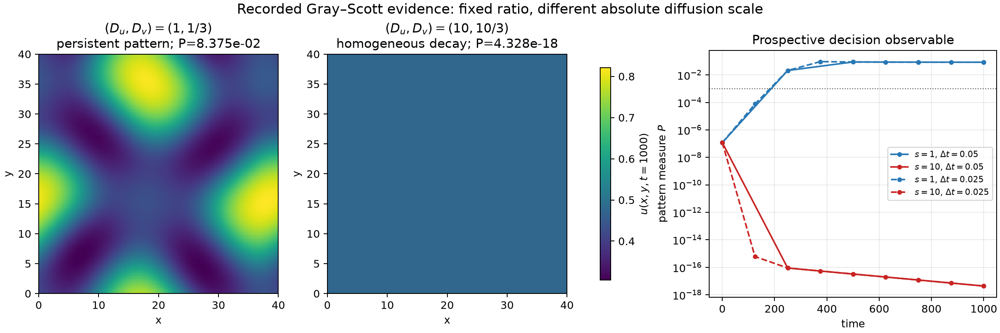
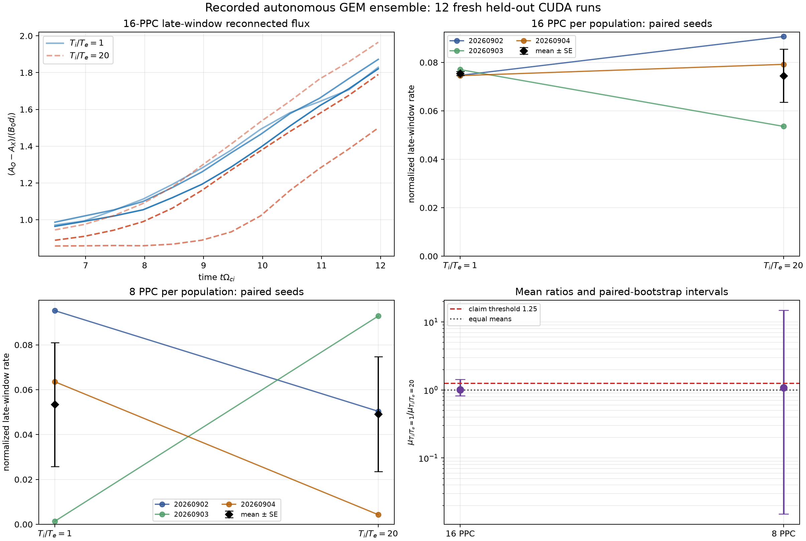

# Simjecture

[](https://doi.org/10.5281/zenodo.21945749)

**Hypothesize. Simulate. Falsify.**

Simjecture is an evidence-governed autonomous experimentation and falsification
system for computational science. It tackles long-horizon problems inside a
human-defined problem contract where finding a useful law or counterexample
requires a difficult search, but a proposed result can be checked much more
cheaply. The model grows and tests a tree-like graph of competing hypotheses,
writes its own experiments and diagnostics, and searches deliberately for the
simplest result that survives independent verification. The harness controls
what may count as evidence.

> **Research preview:** version 0.1 validates the infrastructure and records real
> autonomous simulation campaigns. It does not claim to solve arbitrary
> scientific prose, establish truth about nature from one simulator, or replace
> independent scientific review.

The project began as an autonomous conjecture-solving harness for computational
plasma physics. The same claim ledger, sandbox, commissioning rules, and
capability framework are now ready to extend to other simulation-gated fields
that have a sharp question and a checkable instrument. Version 0.1 records
both the origin domain and that generalization.

## The core idea: AI low-hanging fruit

Scientific problems are not uniformly difficult. A candidate may be buried in
a vast space of mechanisms, representations, and parameter regimes, while the
decisive properties of that candidate are comparatively inexpensive to test.
This **discovery–verification asymmetry** is a difficulty inversion: a problem
that is high-hanging for human intuition may be low-hanging for a machine that
can sustain search, write code, change representation, and reject failed ideas
without fatigue.

An **AI low-hanging-fruit problem** is therefore not a trivial problem. It is a
scientifically valuable problem with a favorable machine difficulty profile:

- a sharply defined question and evidence standard;
- a large but structured space that benefits from persistent search;
- a compact possible answer, such as a matched counterexample, scaling law,
  phase boundary, missing variable, or impossibility statement; and
- an affordable path to checking that answer without trusting model prose.

The project tries to exploit this structure in computational science, where
verification is graded, stochastic, model-dependent, and numerically fallible.
A simulator producing a plausible figure is not a verifier; admissibility,
convergence, uncertainty, independent diagnostics, and fresh confirmation all
matter.

## Search a hypothesis tree, not just a parameter grid

The human supplies an immutable root proposition and the scientific boundaries.
The agent owns the route through a changing frontier of daughter hypotheses:
competing explanations, measurable predictions, discriminating tests,
instrument checks, specializations, and repairs. Although “hypothesis tree” is
the intuitive picture, the durable structure is a typed graph because one node
may depend on or test several others.

```text
root proposition
├── alternative explanation A
├── alternative explanation B
├── predicted signature / discriminating test
├── instrument and numerical validity claims
└── repaired or narrower proposition after a failure
```

Each experiment should remove uncertainty from this graph, not merely add
another point to a scan. A failed diagnostic challenges the instrument rather
than the physics. A valid counterexample may reject a parent hypothesis, but it
only *motivates* a repaired daughter; that daughter needs new evidence of its
own. Falsified branches remain useful recorded knowledge rather than being
rewritten into a success story.

The running loop makes its current role explicit: a **Falsifier** commissions
and attacks the active claim, a **Scientist** proposes the minimal repair after
a counterexample, and an independent **Judge** reviews a bounded
no-counterexample evidence package. If the Judge finds a gap, testing resumes;
if wall time ends first, the result remains unresolved rather than being
promoted to support.

## Counterexamples are first-class outputs

The default scientific posture is destructive: ask what cheapest valid
calculation could break the active claim. Useful witnesses include two matched
cases with different outcomes, a bound or invariance violation, a monotonicity
reversal, a threshold crossing, or a path-dependence pair. A candidate witness
has asymmetric leverage: one verified witness can reject a universal
sufficiency or bound claim even when confirming that claim everywhere would be
impossible. It must still pass numerical and physical validity gates, survive
fresh held-out tests, and face deliberate attempts to explain it away or
falsify the resulting law.

The primary output is therefore not generated prose. It is an independently
inspectable **discovery package**: the hypothesis graph, compact discovery
object, exact commands, source hashes, simulator outputs, diagnostics,
uncertainty and validation results, failed alternatives, falsification attempts,
and scoped claim dispositions. An honest bounded null result is also acceptable.

## How the search works

```text
human-defined question + root hypothesis + evidence standard
                              │
                              ▼
             search the typed hypothesis frontier
                              │
                              ▼
             choose a discriminating intervention
                              │
                              ▼
       agent-authored experiment, diagnostic, or simulation
                              │
                              ▼
       commissioning + physical and numerical validity gates
                    │                         │
              invalid run                 valid evidence
                    │                         │
         recorded non-evidence      support / counterexample /
         and instrument repair            unresolved result
                    │                         │
                    └──────────┬──────────────┘
                               ▼
                    update the hypothesis graph
                               │
                               ▼
             fresh confirmation + adversarial attack
                               │
                               ▼
                  verifiable discovery package
```

The agent owns scientific choices within the supplied scope; the harness owns
evidence eligibility. It does not hard-code a plasma model, diagnostic sequence,
or daughter-hypothesis tree, even though plasma was the first domain. It does
require prospective evidence contracts, commissioned instruments, immutable
provenance, and guarded claim closure so that a persuasive explanation cannot
substitute for a valid result.

## Explore a completed run — no API key required

The fastest way to see Simjecture is to replay the recorded Gray–Scott campaign.
It is a real 23.8-minute autonomous run, preserved with its hypothesis tree,
transcript, agent-written programs, numerical evidence, and provenance. Replay
is read-only: it makes no model calls and starts no simulations.

```bash
git clone https://github.com/tomzhu0225/simjecture.git
cd simjecture
uv sync --frozen
uv run python demos/gray_scott_counterexample/verify_record.py
uv run simjecture web demos/gray_scott_counterexample/record --read-only
```

Inside the browser dashboard, select hypotheses in the interactive graph to
inspect their evidence contracts, linked results, validation claims, activity,
figures, and terminal conclusion. For a non-interactive summary instead, run:

```bash
uv run simjecture status demos/gray_scott_counterexample/record
```

The browser is the primary human-readable projection. The files in the recorded
run remain the authoritative scientific record. The optional Textual interface
is maintained for SSH and browserless operation with `uv sync --extra tui` and
`uv run simjecture tui <run>`; new interactive UX targets the Web interface.

## Quick start

Requirements:

- Linux with Python 3.11 or newer
- [uv](https://docs.astral.sh/uv/)
- Bubblewrap (`bwrap`) for the isolated natural-language MVP
- an API key for an enabled model provider

```bash
git clone https://github.com/tomzhu0225/simjecture.git
cd simjecture
uv sync --frozen
uv run simjecture install core

export DEEPSEEK_API_KEY='your-process-local-key'
uv run simjecture mvp \
  --hypothesis "A charged particle's magnetic moment is conserved when the magnetic field varies slowly across its gyro-orbit." \
  --output artifacts/magnetic-mirror-mvp
```

`conjecture-solver` and `acs` remain compatibility aliases. The internal Python
package remains `conjecture_solver`, preserving the implementation namespace
used by existing capabilities and integrations. Never place a real provider key
in a tracked file, prompt, run workspace, or command transcript.

An operator may add an instrument preference without changing the root
hypothesis:

```bash
uv run simjecture mvp \
  --hypothesis-file hypothesis.txt \
  --instruction "Use the installed WarpX capability." \
  --output artifacts/campaign
```

For expensive problems, `--guided-commission` can provide a known-runnable,
operator-validated starting program. Guided files remain non-evidentiary until
the agent prospectively contracts and executes fresh evidence.

Inspect a durable run without starting another campaign. These commands do not
require the optional terminal extra and do not invent a scientific completion
percentage:

```bash
uv run simjecture status artifacts/magnetic-mirror-mvp
uv run simjecture watch artifacts/magnetic-mirror-mvp
```

A missing `mvp_report.json` is reported as incomplete, not as running. Ctrl-C
on `watch` stops the viewer only. `pause` requests a stop at the next action
boundary; `resume` repeats a self-contained stored launch contract without
resetting its cumulative wall-time budget. External writable or configuration
paths require the operator to repeat the reviewed original command.

The local browser interface shows the hypothesis graph, live typed activity,
evidence, generated figures, and final conclusion. It is included in the core
installation:

```bash
uv run simjecture web artifacts/magnetic-mirror-mvp
```

Run `simjecture web` without a path to discover recent campaigns or launch a
new hypothesis. The server binds to localhost only; `--read-only` disables
all launch and process controls. Provider credentials remain in the launching
terminal environment and are never entered into the browser.

The maintenance-mode terminal dashboard is a projection of the same artifacts
for SSH and headless machines:

```bash
uv sync --extra tui
uv run simjecture tui
uv run simjecture tui artifacts/magnetic-mirror-mvp
```

Its primary view separates the scientific hypothesis tree from instrument,
diagnostic, and control claims attached to the selected hypothesis. Press `v`
for the complete typed audit ledger; no claim or provenance record is hidden by
the human-first projection.

## DeepSeek Harness integration

The v0.2.1 integration moves the model-facing research loop to DeepSeek Harness
without moving scientific authority out of Simjecture. DSH owns the provider,
conversation, retry policy, compaction, and resumable session. A native MCP
boundary implements 21 typed endpoints. A compact persistent Lead Scientist
sees six coordination tools and delegates claim work to fresh, scoped
Falsifier/Experimenter and Repair Scientist sessions. A separate fresh,
tool-free Judge reviews surviving claims. The Python campaign kernel continues to own hypotheses,
evidence contracts, commissioning, skills, simulation capabilities, sandboxing,
provenance, and guarded claim closure. Existing WarpX CPU/CUDA capabilities use
the same kernel path. The isolated DSH profile has no interactive approval gate
around those tools; CampaignKernel's typed boundary and sandbox remain the
execution authority. Provider and model selection remain DSH configuration.
Every role handoff is verified against durable kernel state. Scientific support
is reviewed by the Judge, and only the kernel's deterministic finish gate can
write the terminal campaign report.

The browser remains the primary interface. Once the pinned DSH profile is
installed, the usual `uv run simjecture web` command launches new campaigns
through DSH; existing campaign replay is unchanged. `--engine native` retains
the built-in runner as an explicit compatibility and diagnosis path.

The integration is a small DSH profile bundle, not a second simulator stack.
Provision Simjecture and any desired runtime on the host, then follow
[the DSH deployment guide](docs/how-to/deepseek-harness.md) to install and audit
the isolated profile. `simjecture dsh-profile` locates the bundled profile from
either a checkout or an installed wheel. Long simulations return durable job
identifiers, but the DSH waiter performs lifecycle polling inside the original
tool execution instead of spending model turns on repeated status calls. An
authenticated worker receipt lets a restarted DSH/MCP client recover a known
outcome without repeating the run; an unverifiable outcome remains non-evidence.
The first snapshot after a restart reports durable job IDs and remaining action
and active-execution budgets. The resumed DSH process reopens the same stable
event-sourced session, reconciles that snapshot, and continues without hidden
process state or charging stopped-process downtime.

## Core safeguards

- Network-isolated writable agent workspace with no provider credentials.
- Typed, single-action model protocol and bounded tool outputs.
- Prospective evidence contracts with machine-checkable JSON assertions.
- Workbench artifacts permanently separated from evidence-stage artifacts.
- Source- and command-bound capability commissioning.
- Exact artifact provenance, hashes, seeds, runtimes, and claim linkage.
- Durable transcripts, crash recovery, replay, cancellation, and idempotency.
- Numerical failure remains non-evidence.
- Immutable root-claim and guarded scientific closure semantics.
- Soft startup literature search when public retrieval is available.

## Current evidence

| Evaluation | Status | What it establishes |
|---|---|---|
| Matched-moment kinetic sufficiency | Qualified planted counterexample | End-to-end analytic, independent PIC, and WarpX verification in the plasma origin domain |
| Magnetic mirror and nonlinear Landau MVPs | Completed plasma research runs | Natural-language operation on origin-domain problems |
| Gray–Scott MVP | Completed research run | Same harness on a non-plasma, agent-authored instrument |
| [Collisionless GEM held-out campaign 0004](demos/collisionless_gem_reconnection/) | 12 fresh CUDA runs completed | Guided autonomous commissioning, execution, analysis, and guarded claim handling |

Run 0004 produced a finite-sample point-estimate falsification of its operational
child claim, while its three-seed uncertainty interval still crossed the proposed
population threshold. The immutable root remained open. This is documented as a
real autonomous run and an example of why machine provenance does not remove the
need for independent scientific audit.

Version 0.1 ships that harness. The next step is to use it: apply the same
claim ledger, sandbox, commissioning rules, and capability framework to more
simulation-gated problems, and hunt independently confirmed new results — a
compact law, a matched counterexample, or a scoped impossibility — in the
origin domain and beyond.

## Recorded autonomous demos

The repository includes two inspectable release demonstrations rather than only
descriptions of past runs.

### Gray–Scott finite-domain counterexample

Starting from a natural-language Gray–Scott hypothesis and no campaign
instruction, the agent rejected an unsuitable installed capability, authored
its own numerical instrument, proposed and tested a daughter hypothesis, and
found a finite-domain counterexample in 23.8 minutes.



The package contains the exact input, complete transcript, portable hypothesis
ledger, prospective evidence contracts, final report, source and command
provenance, all agent-written programs, numerical arrays, integrity checker,
and read-only web and TUI replays. See
[`demos/gray_scott_counterexample/`](demos/gray_scott_counterexample/).

### Collisionless GEM reconnection ensemble

Starting from a validated, explicitly non-evidentiary GEM CUDA instrument, the
agent designed a held-out confirmation campaign, commissioned its simulator and
analyzer, and executed 12 fresh fully kinetic simulations across three paired
seeds, two temperature ratios, and two particle counts. Each run used a
256×128 grid, four kinetic populations, 4,623 explicit steps, and 26 openPMD
field states.



The 16-PPC endpoint ratio was `1.0122`, with a paired-bootstrap 95% interval of
`[0.8232, 1.4374]`, against a proposed threshold of `1.25`. The frozen
finite-sample rule falsified the operational daughter, while the population
root remained open because the three-seed interval crossed the threshold. The
package preserves the exact autonomous transcript and claim ledger, all 12 run
summaries, hash-addressed provenance for 482 original artifacts, and
representative final fields. See
[`demos/collisionless_gem_reconnection/`](demos/collisionless_gem_reconnection/).

Every campaign also exposes the built-in
[`scientific-markdown`](skills/scientific-markdown/SKILL.md) skill. It gives the
agent a common notation for equations, code identifiers, contracts, evidence
notes, and conclusions while keeping decision rules and validation checks in
their machine-readable JSON fields.

## Optional WarpX capability

WarpX is the first simulation skill and executable capability, not an
architectural dependency. The versioned skill covers PICMI interfaces, explicit
and implicit time integration, openPMD diagnostics, numerical risks, CPU/GPU
deployment, and resource scaling. Local runtime installations remain ignored by
Git and are mounted read-only into the sandbox.

Install and verify the release-pinned CPU capability with:

```bash
uv run simjecture install warpx-cpu
uv run simjecture doctor --profile warpx-cpu
```

CUDA remains an explicit hardware-specific profile whose audited WarpX source
checkout must be supplied by the operator. The installer validates its pinned
revision before invoking the existing build and openPMD probe.

See [`skills/warpx/SKILL.md`](skills/warpx/SKILL.md) and the deployment reference
in [`skills/warpx/references/local-cuda-deployment.md`](skills/warpx/references/local-cuda-deployment.md).

## Documentation

The curated documentation uses Sphinx, MyST Markdown, and the PyData Sphinx
Theme.

```bash
uv sync --group docs
uv run --group docs sphinx-build -W --keep-going -b html docs docs/_build/html
```

Start with [`docs/index.md`](docs/index.md). The accompanying manuscript is
maintained separately until its archival release.

## Development

```bash
uv sync --all-groups --extra tui
uv run ruff check .
uv run pytest
uv run simjecture schemas --output schemas --check
```

See [CONTRIBUTING.md](CONTRIBUTING.md), [SECURITY.md](SECURITY.md), and
[THIRD_PARTY_NOTICES.md](THIRD_PARTY_NOTICES.md).

## Repository map

```text
src/conjecture_solver/   core runtime, shared projections, CLI, web UI, and TUI
skills/                  versioned model-readable scientific capabilities
capabilities/            installed executable capability manifests
demos/                   bounded demonstrations and operator examples
schemas/                 committed public JSON Schemas
scripts/                 qualification, deployment, audit, and maintenance tools
tests/                   deterministic and integration regression coverage
docs/                    curated documentation
```

## Citation and license

Citation metadata is provided in [CITATION.cff](CITATION.cff). Version 0.1.0 is
archived at [doi:10.5281/zenodo.21945749](https://doi.org/10.5281/zenodo.21945749);
the [concept DOI](https://doi.org/10.5281/zenodo.21945748) resolves to the release
series. Cite the exact software version and Git commit used for a result.

Copyright 2026 Bowen Zhu and contributors. Licensed under the
[Apache License 2.0](LICENSE).
