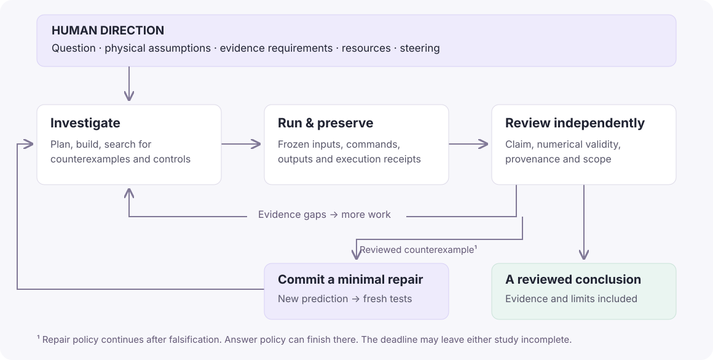

# Simjecture

[](https://pypi.org/project/simjecture/)
[](https://github.com/tomzhu0225/simjecture/actions/workflows/ci.yml)
[](https://doi.org/10.5281/zenodo.21945748)

[Try online](https://simjecture.com) · [Documentation](https://drawingsword.com/simjecture/) ·
[Research loop](docs/concepts/research-loop.md) · [Recorded studies](docs/demos/index.md) ·
[Contributing](CONTRIBUTING.md)

**Hypothesize. Simulate. Falsify.**

Simjecture runs autonomous numerical investigations from a human-defined scientific
question. An agent designs experiments, searches for counterexamples and tests
revised hypotheses. The evidence system preserves what ran and a separate reviewer
examines whether the results justify the conclusion.

You set the question, physical scope and budget. The agent chooses how to work.
You can inspect intermediate results, steer the investigation and continue it in a
new phase. The result is a research record you can follow from hypothesis to code,
measurements, counterexamples and review.

## The research loop



A counterexample must survive the relevant numerical controls. Under the **repair**
completion policy, the agent then proposes the smallest justified change to the
hypothesis, commits its predictions before testing them, and collects fresh
validation evidence. Missing evidence sends the work back through the loop.

The **answer** policy can also finish with a reviewed falsification of the original
claim. New browser studies default to answer; the CLI defaults to repair. Both use
minimal mode by default: flexible agent strategy, recorded experiments and explicit
scientific acceptance. A deadline can leave the question unresolved.

Read [how the loop works](docs/concepts/research-loop.md) or
[how evidence is checked](docs/concepts/evidence-and-claims.md).

## Follow a real investigation

[**Magnetic-island coalescence with FLASH**](docs/demos/island-coalescence.md)
asks whether one reconnection-rate scaling survives changes in resistivity and
resolution. Explore actual field evolution, the historical campaign and its
statistical correction, and a separate fresh minimal-mode investigation.


*Actual 2D commissioning fields. The linked study separates instrument readiness
from evidence for the scaling hypothesis.*

The [orbital-accuracy walkthrough](docs/demos/kepler-energy.md) uses the current
minimal workflow to investigate a concrete question: **does small energy error
imply an accurate trajectory?** It connects the operator's brief, actual numerical
experiments, hypothesis revisions and independent review. It found five counterexamples in the original case matrix, then supported a
four-case repair using fresh simulations and independent review. The retained
record can be verified without a model call.

Earlier records remain available. In the
[historical Gray–Scott study](docs/demos/gray-scott.md), the harness rejected an
attempt to close a claim using evidence commissioned for a different claim. The
agent registered the missing contract and ran fresh experiments before closing it.
That record documents the classic workflow; it is not presented as a new-version run.

## What the evidence system preserves

| Question you should be able to ask | Recorded material |
|---|---|
| What was being tested? | Original hypothesis, operator requirements and committed repairs |
| What actually ran? | Frozen source and inputs, command, runtime identity and execution receipt |
| Where did this number come from? | Output files, hashes and the experiment cited by the claim |
| What challenged the result? | Counterexamples, controls, failed attempts and review gaps |
| Why did the investigation finish? | Independent review, completion policy and budget or stop reason |

A repaired claim cannot reuse old exploratory results as fresh validation. Changed
committed source, missing committed cases and altered recorded outputs are checked
by the service. Numerical adequacy and scientific interpretation remain review
judgments. See [the evidence guide](docs/concepts/evidence-and-claims.md).

## Try it

Open **[simjecture.com](https://simjecture.com)** for the hosted workspace with
supplied inference and compute within usage limits. Signed-in visitors can upload
files and retain projects. Guest conversations and artifacts are temporary.

For your own Linux or WSL machine, install the latest stable release:

```bash
curl -fsSL https://github.com/tomzhu0225/simjecture/releases/latest/download/install.sh | bash
```

The installer verifies the release bundle and prepares Python and the browser
workspace. Reopen it with `~/simjecture/start-workspace`. Research files live under
`~/simjecture/artifacts/projects`. See [installation options](docs/getting-started/installation.md).

1. Choose a compatible API model or an authenticated native agent in the workspace.
2. Discuss your question and prepare a study brief with **Autonomous research**.
3. Review its hypothesis, evidence requirements, completion policy and budget.
4. Start the investigation and follow its experiments and **Evidence & review**.

The [first-study tutorial](docs/getting-started/first-run.md) walks through the full
counterexample-and-repair workflow. [Headless studies](docs/how-to/headless-studies.md)
cover terminal launches and automation.

## Bring your instruments and compute

Ordinary Python studies work without an external solver. Optional capabilities
include WarpX, operator-supplied FLASH, EOS/opacity tools, ITER diagnostics and
[GPU cylinder flow](docs/how-to/cylinder-flow.md). The cylinder solver and its
validation records were contributed by [Zifei Meng](https://github.com/ZifeiMengSPH).

- [Commission a scientific instrument](docs/how-to/guided-commissioning.md) or
  [add your own capability](docs/how-to/add-a-capability.md).
- [Run experiments on local or SSH workers](docs/how-to/ssh-workers.md).
- [Steer or continue an investigation](docs/how-to/continuation-steering.md).
- [Compare agents on recorded diagnostic tasks](docs/how-to/llm-bench.md).
- [Operate a hosted service](docs/how-to/public-trials.md).

Native agents retain their existing tools and run with their host-account access.
Numerical experiments use the selected execution backend, Bubblewrap by default.
Read [security guidance](SECURITY.md) and
[restricted-host setup](docs/how-to/restricted-containers.md) when deploying workers.

## Contribute

Help us test the research process on meaningful questions. Contributions can add
scientific instruments, validated diagnostics, reproducible studies, numerical
review, documentation or infrastructure. Start with [CONTRIBUTING.md](CONTRIBUTING.md)
or [open an issue](https://github.com/tomzhu0225/simjecture/issues) to discuss a study
or a substantial change.

[Release notes](CHANGELOG.md) · [Release checks](docs/archive/index.md) ·
[Research status](docs/research/status.md) · [Historical records](docs/archive/index.md)

## Citation and license

Use [CITATION.cff](CITATION.cff) and identify the exact version and Git commit used
for a result. The [concept DOI](https://doi.org/10.5281/zenodo.21945748) identifies
the release series.

Copyright 2026 Bowen Zhu and contributors. Licensed under [Apache 2.0](LICENSE).
See [third-party notices](THIRD_PARTY_NOTICES.md) for upstream attribution and
redistribution requirements.
