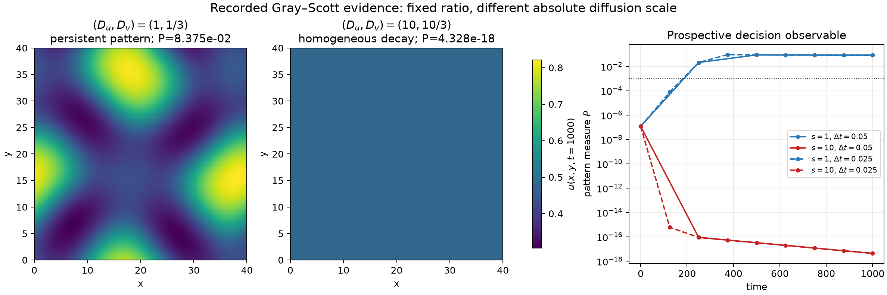

# Simjecture

[](https://doi.org/10.5281/zenodo.21945748)

[Quickstart](#install-and-open-the-workspace) · [Documentation](docs/index.md) ·
[Recorded demo](docs/demos/gray-scott.md) · [Contributing](CONTRIBUTING.md) ·
[Releases](https://github.com/tomzhu0225/simjecture/releases)

**Hypothesize. Simulate. Falsify.**

Simjecture is a research workspace for computational science. Work with an agent to
turn a question into a bounded study, run experiments, search for counterexamples,
and test repairs to failed hypotheses. The harness records what ran and requires
independent review before a scientific claim can close.

Use a compatible API model or an installed native agent CLI. Start in the browser
workspace; terminal and headless workflows are available when you need automation.



A [recorded Gray–Scott study](docs/demos/gray-scott.md) found a finite-domain
counterexample. You can inspect its code, evidence and review without an API key or
new simulations. Simulation results remain conditional on the model and numerical
scope; see [scientific limitations](docs/research/limitations.md).

## Install and open the workspace

On Linux or inside WSL, install **Simjecture 0.5.3**:

```bash
curl -fsSL https://github.com/tomzhu0225/simjecture/releases/download/v0.5.3/install.sh | bash
```

The installer verifies the release bundle's checksum, sets up uv, Python 3.12 and
workspace dependencies, then starts the local GUI. Git and a CLI agent are not
required. For Python-package installation, SSH forwarding or source setup, see
[installation options](docs/getting-started/installation.md).

1. In **Connections**, add a compatible API endpoint and key, or select an installed,
   authenticated CLI in the message composer
2. Start a conversation with your question, paper or simulation outputs
3. Open **Autonomous research**, prepare a study with the agent, and review its
   question, evidence requirements and budget before starting
4. Follow the recorded experiments and independent review in the study view

Reopen the workspace with `~/simjecture/start-workspace`. Research files stay under
`~/simjecture/artifacts/projects`, separate from versioned application folders.
Keep the server terminal open or use a session manager. Ubuntu/Debian may request
sudo to install Bubblewrap; restricted hosts may need additional execution setup.

Follow the [workspace walkthrough](docs/getting-started/research-workspace.md) for
agent selection and your first investigation, or try the
[no-key recorded demo](docs/demos/gray-scott.md#audit-or-replay) first.

## What you can do

- **Investigate a question:** work interactively, then launch a bounded autonomous
  study with recorded evidence and independent methods/claim review
- **Challenge and repair hypotheses:** search for counterexamples, preserve claim
  ancestry, and test committed predictions with fresh evidence
- **Use scientific instruments:** commission optional WarpX, operator-supplied
  FLASH, EOS/opacity tools and ITER diagnostics, or add your own capability
- **Run local or SSH experiments:** select numerical workers and track resource
  reservations, execution receipts and recovery
- **Continue an investigation:** prepare a linked phase with a new budget and
  selected prior files, or send advisory guidance at a checkpoint
- **Compare coding agents:** run task-scoped benchmarks over recorded diagnostics
  and inspect completion, time, cost and missing measurements

Minimal mode is the default: the agent chooses its research strategy while the
host manages evidence, review and deadlines. Structured and frontier modes are
also available. See [research modes and evidence](docs/how-to/research-service.md)
and [architecture](docs/concepts/architecture.md).
In the development source, new minimal studies also use a [research director](docs/how-to/minimal-oversight.md#research-director-stop-and-replan)
to check feasibility during long jobs, stop named experiments and request recorded
replans. Its launch switch and decisions are visible in the workspace; scientific
claim acceptance remains independent.

Numerical experiments use Bubblewrap by default. Native agents are trusted
same-account processes with host tools; the experiment sandbox does not enclose
them. Explicit cooperative PRoot execution is not an OS security boundary. Read
[security guidance](SECURITY.md) before running sensitive workloads and
[restricted-host setup](docs/how-to/restricted-containers.md) when needed.

## Find your next step

- **Use the workspace:** [first investigation](docs/getting-started/first-run.md),
  [continue or steer a study](docs/how-to/continuation-steering.md)
- **Automate from a terminal:** [headless studies](docs/how-to/headless-studies.md),
  [command reference](docs/reference/cli.md),
  [optional terminal dashboard](docs/getting-started/terminal-ui.md)
- **Prepare an instrument:** [guided commissioning](docs/how-to/guided-commissioning.md),
  [runtime deployment](docs/how-to/deploy-runtimes.md),
  [ITER ecosystem pack](docs/how-to/iter-pack.md)
- **Add compute:** [SSH workers](docs/how-to/ssh-workers.md)
- **Evaluate models:** [benchmark and community submissions](docs/how-to/llm-bench.md)
- **Inspect the science:** [evidence and claims](docs/concepts/evidence-and-claims.md),
  [evaluation status](docs/research/status.md),
  [research and release archive](docs/archive/index.md)

**0.5.3** brings SSH experiment workers, the measured coding-agent leaderboard,
ledger and recovery repairs, and shared conversation/study/evidence navigation.
Release changes live in [CHANGELOG.md](CHANGELOG.md); checks and limits are in the
[0.5.3 acceptance record](docs/testing/0.5.3-acceptance.md) and
[archive](docs/archive/index.md). The
[documentation index](docs/index.md) covers the full guide set.

## Contributing

Researchers, developers and first-time contributors are welcome. Help improve an
example or guide, reproduce a bug, add a tested diagnostic or scientific capability,
review numerical methods, or share benchmark results.

Pick a small task in [CONTRIBUTING.md](CONTRIBUTING.md), which includes setup and
checks for each kind of change. [Open an issue](https://github.com/tomzhu0225/simjecture/issues)
to discuss an idea or reproducible problem; discuss large changes before implementing
them. For security-sensitive reports, follow [SECURITY.md](SECURITY.md).

## Citation and license

Use [CITATION.cff](CITATION.cff) and cite the exact version and Git commit used for a
result. The [concept DOI](https://doi.org/10.5281/zenodo.21945748) identifies the software
release series.

Copyright 2026 Bowen Zhu and contributors. Licensed under the
[Apache License 2.0](LICENSE). See [third-party notices](THIRD_PARTY_NOTICES.md) for
upstream attribution and redistribution requirements.
