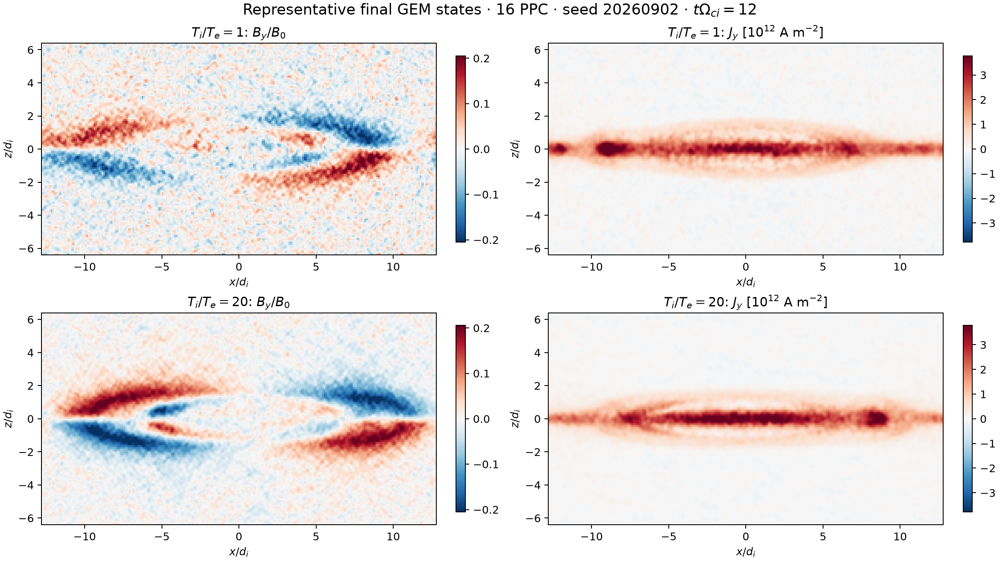

# Collisionless GEM reconnection held-out ensemble

**Recorded guided autonomous run · completed · 12 fresh CUDA simulations ·
177.0 minutes**

This is the primary plasma demonstration for version 0.1. It preserves a real
end-to-end campaign in a two-dimensional, three-velocity (2D3V), fully kinetic
electron-ion Harris sheet based on the normalized geometry of the GEM magnetic
reconnection challenge.

The immutable root hypothesis was:

> In two-dimensional, non-relativistic, fully kinetic, collisionless
> electron-ion GEM-type Harris-sheet reconnection at reduced mass ratio 25 and
> the fixed physical geometry and normalization of the supplied guided regime,
> the seed-ensemble mean late-window normalized flux-slope reconnection rate at
> Ti/Te = 1 is at least 25 percent larger than at Ti/Te = 20 (mu_1 / mu_20 >=
> 1.25), and this endpoint contrast persists under a numerical-fidelity control.

The operator supplied a content-addressed, known-runnable CUDA/openPMD GEM
program and its validation record. Those files were explicitly
non-evidentiary. The agent chose and froze the prospective confirmation design,
fresh seeds, particle counts, time window, estimator, uncertainty calculation,
decision rule, and instrument contracts before collecting claim-bearing
results.

The supplied instrument records the
[GEM magnetic reconnection challenge](https://doi.org/10.1029/1999JA900449)
and the [review of the 0.1 reconnection-rate problem](https://doi.org/10.1017/S0022377817000666)
as benchmark context. Literature metadata informed the setup and audit but was
never counted as evidence for the temperature-ratio claim.


## What happened

1. Startup reconnaissance searched the literature for kinetic Harris-sheet
   reconnection rates, temperature-ratio dependence, reduced-mass-ratio
   effects, and numerical-fidelity requirements.
2. The agent created one operational daughter hypothesis and two attached
   instrument claims: one for the WarpX simulator and one for the ensemble
   analyzer.
3. It commissioned the fully kinetic CUDA simulator against 26 checks spanning
   representation, physics controls, boundaries, diagnostics, and numerical
   regime. It independently commissioned the analyzer with deterministic
   fixtures.
4. It excluded the exploratory seed `20260814`, selected three fresh paired
   seeds, and ran both temperature endpoints at 16 and 8 particles per cell per
   population.
5. It evaluated the late-window flux-slope estimator, exact-header field-plus-
   particle energy totals, group means, and a paired 100,000-resample bootstrap.
6. The frozen point-estimate rule falsified the operational child. The harness
   retained the broader population root as open.

## Frozen numerical regime

| Property | Recorded value |
| --- | --- |
| Model | 2D3V collisionless electromagnetic PIC; four fully kinetic populations |
| Field/deposition algorithms | Explicit Yee / Esirkepov |
| Grid and domain | `256 × 128`; `Lx = 25.6 d_i`, `Lz = 12.8 d_i` |
| Harris sheet | half-width `0.5 d_i`; background fraction `0.2`; zero guide field |
| Normalization | `m_i/m_e = 25`; `V_A,ref/c = 0.04`; `n_sheet = 10^24 m^-3` |
| Dimensional fields | `B0 = 65.4209 T`; `d_i = 26.5705 µm`; `d_e = 5.3141 µm` |
| Resolution | `dx = dz = 0.5 d_e`; 8 or 16 PPC per population |
| Time integration | 4,623 steps; `dt = 5.64035 × 10^-15 s`; `dt ω_pe = 0.3182`; CFL fraction `0.9` |
| Duration and diagnostics | `t Ω_ci = 12.0013`; 26 openPMD field states per run |
| Boundaries | periodic in `x`; conducting fields and reflecting particles in `z` |
| Fresh seeds | `20260902`, `20260903`, `20260904` |

At 16 PPC the nominal population was 2,097,152 macroparticles per run; at 8
PPC it was 1,048,576. All 12 summaries recorded an active CUDA backend. The
scientific executions reported 6,378.7 seconds of aggregate GPU wall time, and
the full autonomous campaign took 10,619.9 seconds over 75 model iterations.

## Recorded result

The decisive observable was the ordinary-least-squares slope of reconnected
flux over `t Ω_ci ∈ [6, 12]`, normalized by the observed upstream Alfvén speed.
PPC below means particles per cell **per population**.

| Fidelity | mean rate, `Ti/Te=1` | mean rate, `Ti/Te=20` | ratio `R` | paired-bootstrap 95% interval |
| --- | ---: | ---: | ---: | ---: |
| 16 PPC | `0.075411 ± 0.000812` | `0.074500 ± 0.010967` | `1.0122` | `[0.8232, 1.4374]` |
| 8 PPC | `0.053390 ± 0.027564` | `0.049172 ± 0.025574` | `1.0858` | `[0.0150, 14.8310]` |

Values after `±` are seed-ensemble standard errors with `n=3`. All runs passed
the declared absolute energy-drift gate of `2 × 10^-3`; the largest actual
absolute combined drift was `4.8429 × 10^-4`.

The preregistered finite-sample rule required `R16 >= 1.25` and persistence at
8 PPC. Its operational child was therefore falsified by the point estimates.
The three-seed interval at 16 PPC still includes both unity and the proposed
`1.25` population threshold, so the broader root remains unresolved. The 8-PPC
ensemble is strongly seed-sensitive and cannot establish convergence.

```text
○ claim_root                              open
└─ × claim_confirm_seed_ensemble          falsified
   ├─ ✓ claim_instr_simulator             supported
   └─ ✓ claim_instr_analyzer              supported
```



The representative fields above are exact archived final states from the
16-PPC `20260902` pair. The ensemble figure is rendered from the archived JSON
rates and flux histories by [`plot_results.py`](plot_results.py).

## Inspect the real record

Attach the status view or optional TUI directly to the preserved terminal
artifacts:

```bash
uv run simjecture status demos/collisionless_gem_reconnection/record
uv sync --extra tui
uv run simjecture tui demos/collisionless_gem_reconnection/record
```

Verify the curated files against the terminal report and full provenance map,
or regenerate both figures:

```bash
uv run python demos/collisionless_gem_reconnection/verify_record.py
uv run python demos/collisionless_gem_reconnection/plot_results.py
```

The Git package contains the complete top-level manifest, final report,
transcript, literature-search record, claim ledger, claim summary, guided-
commissioning descriptor, and provenance inventory. It also retains all 12
scientific summaries, the frozen agent-authored analysis programs, commissioning
fixtures, and two representative final-field archives: 60 exact workspace
artifacts in total.

The original workspace contains 482 artifacts and 893,147,359 bytes. Bulk raw
openPMD histories and the other ten final-field archives are omitted from Git;
their paths, sizes, hashes, and provenance remain listed in
`record/artifact_provenance.json`. A permanent external archive and DOI are
still required for complete raw-data replication.

## Repeat the full autonomous campaign

The exact natural-language input and content-addressed guided package are
included. After provisioning the release-pinned CUDA capability, a fresh
campaign can be launched with:

```bash
uv run simjecture doctor --profile warpx-cuda
uv run simjecture mvp \
  --hypothesis-file demos/collisionless_gem_reconnection/hypothesis.txt \
  --instruction-file demos/collisionless_gem_reconnection/campaign_instruction.txt \
  --guided-commission demos/collisionless_gem_reconnection/guided_commission.json \
  --campaign-id campaign_collisionless_gem_heldout_confirmation \
  --ledger artifacts/gem-heldout/mvp_ledger.sqlite3 \
  --output artifacts/gem-heldout \
  --max-wall-seconds 28800 \
  --max-command-seconds 3600 \
  --max-workspace-mb 4096 \
  --max-file-mb 512 \
  --max-memory-mb 32768
```

A fresh model-driven campaign is stochastic. It may choose a different valid
prospective design and is not expected to reproduce the transcript.

## Known limitations

- This was guided autonomy: the simulator and one successful anchor were
  operator-supplied, while fresh scientific outcomes were agent-designed and
  agent-executed.
- The physical scope is one 2D, reduced-mass-ratio (`m_i/m_e=25`), short-duration
  GEM regime. It does not establish a general temperature-ratio law.
- Three seeds are insufficient for a precise population ratio; the decisive
  interval crosses the claim threshold.
- The 8-versus-16-PPC comparison is a sensitivity control, not a spatial,
  temporal, or particle-count convergence study.
- The terminal agent prose overstated the population-level conclusion and
  reported the maximum energy drift as `4.59 × 10^-4`. The immutable root status
  and recomputed value `4.8429 × 10^-4` above are authoritative.
- The committed package is independently auditable but does not contain the
  complete 893 MB raw workspace.
