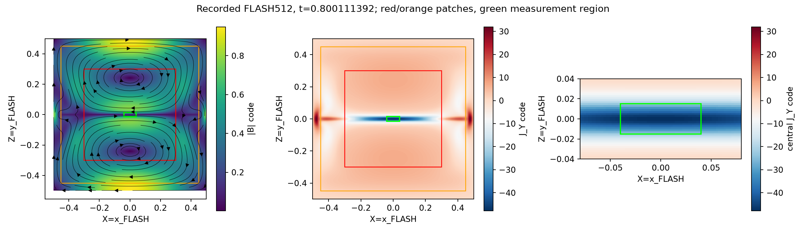
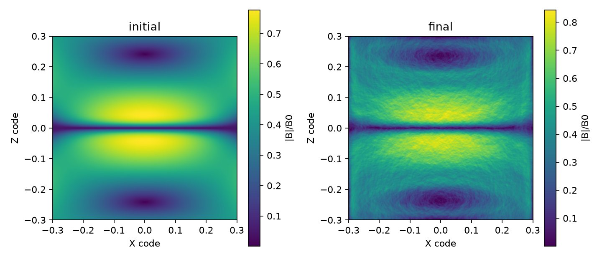
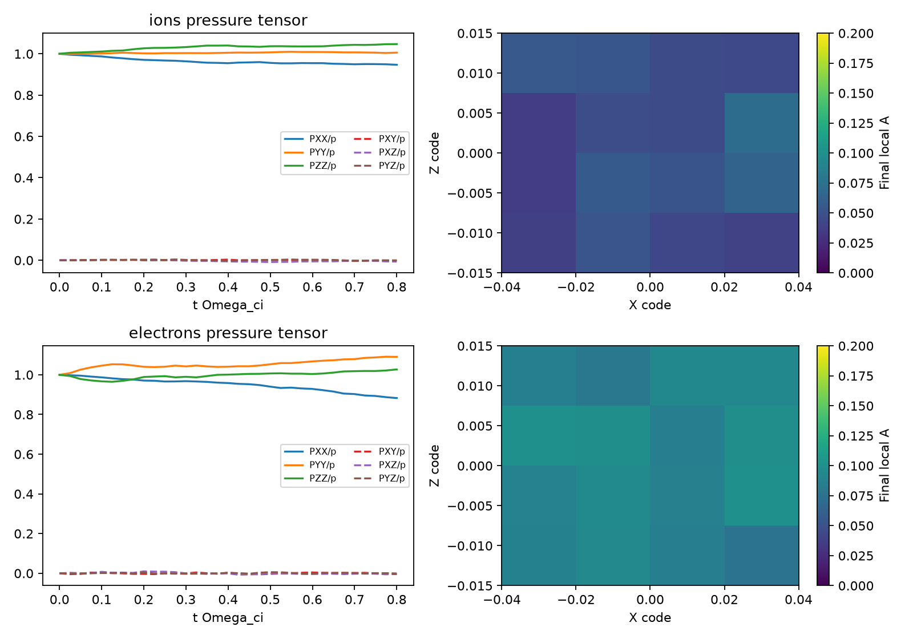
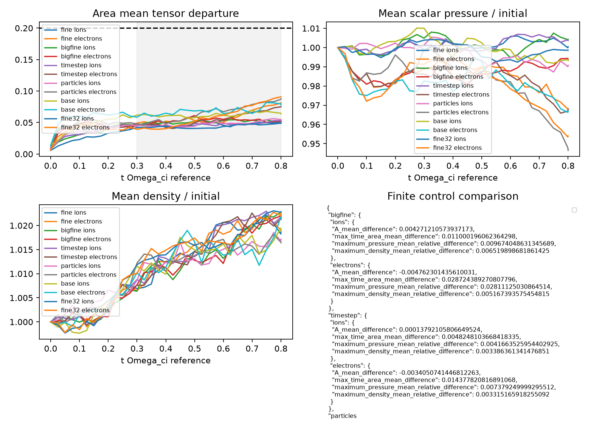

# FLASH-to-WarpX local pressure continuation

**No credible scientific counterexample was found. The original hypothesis is unresolved**, rather than independently supported or falsified. Completed exploratory continuations give mean pressure departures 0.0438–0.0513 for ions and 0.0532–0.0652 for electrons, below the 0.20 bound. The fresh matched-control run and inherited controls qualify a finite measurement method; they do not replace prospective decisive evidence.

Independent production-method review `method_36bc7797591f08c0559a8f02` returned **continue**, authorizing prospective evidence collection only. It independently reproduced the fresh fine32 means from the recorded raw tensors. No accepted scientific claim verdict or completed repair exists. The proposed fresh-seed evidence could not fit after review: historical fine16 required 257.9 seconds, fresh fine32 required 566.6 seconds, and approximately 61 seconds of compute time remained when the approval became available. Director replan `director_02bc5f8bef9f79770a3ee00f` was acknowledged; the full window and scientific thresholds were preserved.

## Finite realization and provenance

The autonomous parent investigation generated an actual resistive FLASH island-coalescence trajectory; the supplied operator anchor is not the source. FLASH uses scalar resistivity 0.001, alpha=20, gamma=5/3, reflecting boundaries and adaptive CFL=0.4. The 512² source is the first recorded state at or after normalized time 0.8, realized at 0.8001113920335353 in parent `exp_b3aeffc4296462890906d872`. The 256² comparison is `exp_858f535fafc4884126e44323`. Parent receipts remain historical and can be inspected through `parent_provenance.json` and its absolute receipt paths. The continuation repeats only the required permanently non-evidentiary anchor as `exp_eef180c184d79e03a3485285`.

The source HDF5 SHA256 is `79d2045d47eaecb729d854e170f3679fa75b9948359d3f380f15caab112b2083`; the exported NPZ SHA256 is `e8d1ef82fb0baafddeaf1b0f8c9e153db6fae069a2a4829cd18e80487bfbd023`. The actual field/current plot is retained as [macro_patch.png](figures/macro_patch.png), with both patch sizes and the fixed measurement region overlaid. Extraction reconstructs flux potential and retains original B, density, scalar pressure and flow. The right-handed rotation is (X,Y,Z)=(x,-z,y), so kinetic JY is minus FLASH Jz. `extract_flash.py`, `prepare_patch.py`, `select_patch.py` and their historical receipts document the transfer; no analytic sheet replaces the source.

The selected central sheet half-width is half the distance between the first half-center-magnitude current crossings along Z, using the average of the two source columns closest to X=0 and linear crossing interpolation. Width is 0.014466925 code lengths or 7.407 FLASH cells, changing about 1.9% under 256→512 refinement. Reference ion skin depth is 0.024 code lengths: width/di=0.60279, about 0.59 using local central density. This is a resolved finite profile comparison, not asymptotic MHD convergence. Source energyFix corrections are not separately counted; reconstructed energy drift about 1.37e-6 is a consistency check, not a closed correction budget.

The additional dimensional choices are physical electron mass, ion mass 25me, initial Ti/Te=1, reference per-species density 1e24 m^-3 and velocity scale 0.01c. They give L0=1.107102764 mm, B0=16.35523569 T, reference di=26.57046633 micrometers and Omega_ci=1.150636631e11 s^-1. Density is rho_code*n0 and total pressure is p_code*n0*(mi+me)*v0². Species drifts preserve center-of-mass flow and Ampere current. Cubic interpolation of the measured flux potential followed by a discrete Yee curl deliberately projects B; fine-patch transfer RMS error is 2.800826e-4 (0.0280%), interior Ampere residual 1.283081e-3 (0.1283%) and scaled divB about 2.5e-16 on the fine patch. The exact fine input SHA256 is `c7c6d6d1c027e421be20942ffa07d6c415479fab6567a2705f6f5b0435697402`; large fine input is `078c357cfa0547a54bc946e80e118ec9dea8a58b06b70ce379f9539cfae07c7e`.

This is a collisionless, one-way initial-condition continuation. PIC excludes FLASH scalar resistivity and initially uses the ideal motional electric field. There is no injection, collision operator, radiation or two-way feedback. Absorbing particles and Silver–Mueller field boundaries define the finite realization; particle travel and field-boundary sensitivity must be considered separately.

## Observable and unchanged decision

`PRESSURE_CONTRACT.md` prospectively fixes |X|<0.04, |Z|<0.015 code lengths, 4×4 equal-area bins and the full interval t Omega_ci in [0.3,0.8], exactly half an inverse reference cyclotron frequency. Physical window is approximately 2.607–6.953 ps, lasting 4.345 ps. Pressure retains three velocity components and subtracts each species' local weighted mean:

$$P_s=m_s\sum_p w_p(v_p-\bar v_s)(v_p-\bar v_s)^T/(\text{bin area}),\qquad
A_s=\frac{\|P_s-\operatorname{tr}(P_s)I/3\|_F}{\operatorname{tr}(P_s)/\sqrt{3}}.$$

The primary observable averages local A over equal areas and then trapezoid-integrates in actual time, interpolating the exact endpoints. It does not take a norm after averaging tensors. Every bracketing/interior bin needs count≥256, effective count≥512 and a finite positive-trace tensor. No bins are dropped. Secondary 8×8 bins separately require count≥128 and effective count≥256. Their covariance reconstruction measures between-sub-bin flow broadening; unresolved shear within those smaller bins remains a limitation.

The uncertainty allowance is at least 0.05 sampling, plus measured absolute changes from grid, timestep, particle count, seed, patch, bins and cadence, plus sqrt(3) times the maximum measured relativistic trace correction. It is a conservative conditional control envelope, not a rigorous distribution-free confidence interval. Support needs both upper endpoints≤0.20 and every frozen qualification gate. Falsification needs a lower endpoint>0.20 for at least one species with every gate qualified. Missing or failed gates mean inconclusive; the bound, region and window will not be fitted to observations.

## Historical full-window controls

The first four rows below are exploratory parent observations; the last is a fresh continuation commissioning observation. None is decisive hypothesis evidence. Fine is 576² over half-size 0.3; enlarged fine is 864² over half-size 0.45 with the same 1.15323 micrometer cells. The CUDA runtime is the installed non-MPI 2D WarpX 26.07 with explicit Yee, Boris, quadratic shape and Esirkepov deposition.

| Case and parent experiment | Mean A ions | Mean A electrons | Wall seconds | Accounted energy residual |
|---|---:|---:|---:|---:|
| Fine16 `exp_55205438f03261250c2f8238` | 0.047019 | 0.058001 | 257.9 | -0.001037 |
| Enlarged fine16 `exp_ba37bf1a0947ae8cb2591db0` | 0.051290 | 0.053239 | 553.5 | -0.001130 |
| Fine16 half timestep `exp_ec59942cf4fe18f457b92418` | 0.047157 | 0.054596 | 571.9 | -0.001106 |
| Coarse384/32ppc `exp_3a4cd829f718a2211536f64c` | 0.047939 | 0.065205 | 415.2 | -0.000790 |
| Fresh fine576/32ppc `exp_a1842d496f9ccf18d93f7647` | 0.043828 | 0.059550 | 566.6 | -0.000494 |

Fine and enlarged fine initial pressure-bin RMS errors are below 0.69%, density RMS below 0.53%, current RMS below 4.50%, and COM velocity error is 0.01383v0 and 0.01610v0 respectively. Fine minimum effective counts exceed 2141. All recorded fine/enlarged/timestep initialization, secondary reconstruction, operational relaxation and aligned energy gates pass. Fourth-moment two-sigma sampling estimates are about 0.02, below the retained 0.05 allowance. Measured relativistic trace correction is approximately 0.00077 for ions and 0.02047 for electrons across the boundary pair; it is included in the envelope rather than dismissed from v0/c alone.

Enlarging the fine patch changes mean A by +0.004271 (ions) and -0.004762 (electrons). Maximum mean pressure differences are 0.97% and 2.81%, density differences 0.65% and 0.52%. The larger patch electron outer-collar-origin fraction is 0.001326; approximately 5.49% originate outside the smaller patch. Finite field signals are not causally excluded. Independent methods review found maximum paired magnetic-RMS differences 0.0182B0 and electric-RMS differences 2.17B0*v0. Modest pressure sensitivity therefore does not mean that the fields themselves are boundary-insensitive. The pressure/density trajectories provide conditional boundary sensitivity, while origin tags bound a different particle effect. Small-patch electrons show a larger 4.20% collar-origin fraction, so the enlarged-patch comparison is essential.

Halving the timestep changes mean A by +0.000138 and -0.003405; maximum pressure differences are below 0.74%. Fine dt=1.90405e-15 s gives EM CFL=0.7, dt*omega_pe=0.1074 and dt*Omega_ce=0.00548. Cell/de≈0.217 and cell/reference Debye≈2.45: the grid is explicitly Debye-underresolved. A matched-particle spatial comparison and the energy controls are required for this particular pressure observable; these runs do not establish general PIC accuracy.

Absorbed-particle energy and nearest-interior-cell Poynting flux are tracked at aligned field/particle sample steps. Flux-cadence sensitivities are 4.18e-6 (fine), 4.42e-5 (enlarged) and 1.71e-5 (half timestep) of initial total energy. Native and live particle energies agree to roundoff. Nearest-cell spatial flux quadrature is approximate; these residuals bound gross numerical source/loss behavior rather than prove exact physical conservation.

The older coarse16 case `exp_1c6e664e972b5f583f31d498` fails the amended COM gate: 0.0318v0>0.03v0. It is retained as a failed qualification, never treated as a scientific counterexample or qualified support. The qualifying coarse32 case has COM error 0.01932v0. The new fine32 case separates the grid comparison from particle count, instead of bypassing that failure. The batched large-patch loader was introduced only to repair memory exhaustion; `exp_868c1e8f20b754137bfd0680` records its deterministic loading check, and actual enlarged evolution qualifies that implementation within its scope. The current fine32 source uses the unchanged full-array fine loader.

## Fresh continuation findings and independent review

`exp_a1842d496f9ccf18d93f7647` completed all 3652 steps to t*Omega_ci=0.800106882. Minimum effective particle counts were 4325.42 (ions) and 4355.41 (electrons), well above the frozen 512 requirement. Exact initial Bx/Bz/Ey errors were zero. Initial pressure-bin RMS errors were 0.392%/0.405%, density RMS 0.270%, current RMS 4.648%, COM velocity RMS 0.01107v0 and charge imbalance zero. The aligned accounted-energy residual was -0.04937%, flux-cadence sensitivity 5.22e-6 and native/live particle-energy mismatch 3.75e-16 of initial energy. All reported initialization, secondary-bin, operational relaxation and aligned-energy gates passed in commissioning. The electron half-window A change was 0.02900, close to the frozen 0.030 limit; ions changed 0.00413. Scalar-pressure transition changes across the relaxation intervals were 0.0568%/0.3978%, density changes 0.4459%/0.5925%. Thus the operational gate passes narrowly for electron anisotropy; elapsed time alone and a broad equilibrium claim are not justified.

The independent recorded audit `exp_2170ea427cd8f5af2df39f06` recomputed pressure tensors, complete-window means and gate measurements. It checked copied parent raw-artifact hashes against their original receipts; that check preserves provenance, not evidence eligibility. Source audit recomputation gives central-region 256→512 relative RMS differences of 0.1127% in density, 0.02131% in pressure, 0.1153% in Bx and 0.07762% in Bz. The source/extraction/patch identities link actual autonomous FLASH evolution to actual WarpX evolution. The operator anchor stays non-evidentiary.

| Control, fixed source and window | Absolute mean-A change ions/electrons | Maximum pressure difference | Maximum density difference | Frozen gate outcome |
|---|---:|---:|---:|---|
| Matched32ppc spatial384→576 | 0.004112 / 0.005655 | 1.406% | 0.951% | Pass: A≤0.02, P≤5%, n≤3% |
| Fixedfine576 ppc16→32 | 0.003191 / 0.001549 | 1.295% | 0.750% | Pass: A≤0.03 |
| Fine16 timestep halving | 0.000138 / 0.003405 | 0.738% | 0.339% | Pass: A≤0.01, P≤3% |
| Fine16 same-cell larger patch | 0.004271 / 0.004762 | 2.811% | 0.652% | Pass: A≤0.02, P/n≤5%, large collar≤1% |

The particle/grid comparison no longer conflates the failed coarse16 COM case with a qualifying spatial control. That failure remains in the audit and is excluded from required qualified cases. The new fine32 calculation does not scientifically falsify the root: its departure is low and its commissioning gates pass, but it was deliberately exploration.

A complete uncertainty interval cannot yet be stated because the prospective seed control and decisive observation are absent. The audited fourth-moment sampling estimates are about 0.014–0.022; the sampling allowance remains at least 0.05. Secondary8-bin versus primary4-bin mean-A changes reach 0.03274 for ions and 0.02784 for electrons among the qualified controls, while cadence-decimation changes are at most 0.000611. Bin changes mix finer-scale physics and positive norm noise and enter the conservative allowance; they are not erased because the mean remains below 0.20. Maximum measured relativistic trace corrections are about 0.00079/0.02070 and must also enter the allowance. Finite controls bound observed sensitivity, not all systematic errors or distribution-free confidence.

## Figures and inspectable artifacts

All figures below were produced from actual retained fields and moments by `exp_2170ea427cd8f5af2df39f06`, with SHA256 identities and exact recorded paths in [evidence_index.json](evidence_index.json). Copied images retain those hashes. Historical figures remain historical observations; the fresh fine32 panels are commissioning observations.

The control plot includes the failed coarse16 case for comparison; its presence does not qualify it. Local final-A color limits are 0–0.20, so the retained numeric tensors, rather than the color scale alone, govern interpretation. Pressure component plots normalize each diagonal/off-diagonal component by the area-mean scalar pressure; the decision still uses local tensor departures before averaging.

Raw decisive-diagnostic material for the fresh control is in [moments.npz](../experiments/exp_a1842d496f9ccf18d93f7647/workspace/kinetic/moments.npz), [history.json](../experiments/exp_a1842d496f9ccf18d93f7647/workspace/kinetic/history.json), [initial fields](../experiments/exp_a1842d496f9ccf18d93f7647/workspace/kinetic/initial_fields.npz), [final fields](../experiments/exp_a1842d496f9ccf18d93f7647/workspace/kinetic/final_fields.npz) and its reduced-energy files. [Audit analysis](../experiments/exp_2170ea427cd8f5af2df39f06/workspace/analysis.json) contains every case and gate; [source qualification](../experiments/exp_2170ea427cd8f5af2df39f06/workspace/source_qualification.json) preserves the macro comparison. [parent_provenance.json](parent_provenance.json) links the original read-only FLASH/WarpX receipts and raw hashes. [PRESSURE_CONTRACT.md](PRESSURE_CONTRACT.md) contains the unchanged prospective rules.

## What remains unresolved

The concrete next test is the reviewed fine576/16ppc, seed20261009 continuation through0.8, under `method_36bc7797591f08c0559a8f02`. It must use the exact transferred fine patch and recorded arguments: `pic --patch fine_patch.npz --output kinetic --duration-omegaci 0.8 --diagnostics 32 --moment-bins 4 --ppc 16 --max-grid-size 576 --seed 20261009 --minimum-bin-particles 256 --boundary-accounting --secondary-bins 8`. Declare every loader/estimator/patch/manifest dependency and collect fresh evidence only under an applicable reviewed binding. Then compare the new seed, enforce every gate, form the complete frozen uncertainty envelope and request independent adjudication. A shortened startup run would not discriminate the original hypothesis.

Even if that finite test supports the root, limitations remain: Debye-underresolved cells, unresolved within-secondary-bin shear, approximate boundary-flux quadrature, operational rather than causal transient exclusion, field-boundary sensitivity and separately uncounted FLASH energyFix corrections. The measured pressure behavior is encouraging and the matched controls improve readiness; the absent prospective evidence is the immediate reason support is not established. There is no accepted counterexample to repair, and the scientific statement has not been weakened or replaced.

The operator supplied the solver installations, anchor and initial extraction/transfer/PIC helpers. Autonomous scientific decisions include source time, refinement, sheet definition, mapping, patch/region/window, estimator, diagnostic extensions, numerical controls and review submissions. No universal reconnection-rate, radiation, global two-way-coupling or general isotropic-pressure result follows from this finite study.
