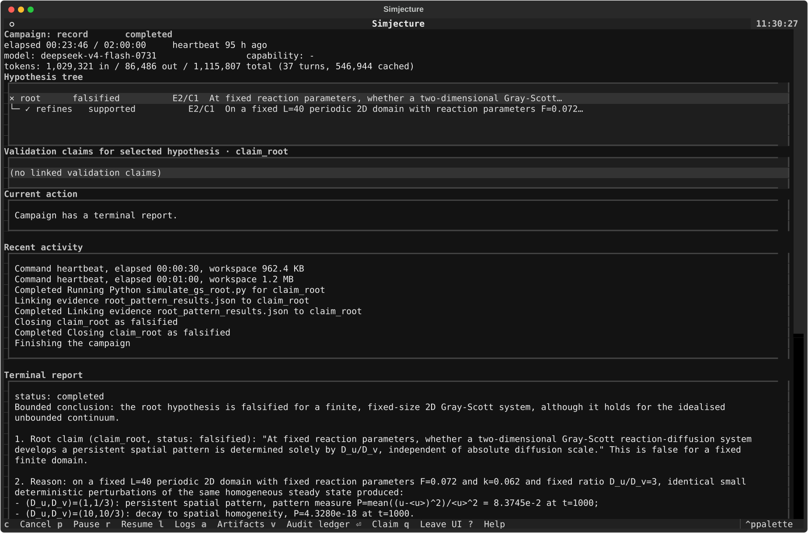

# Gray–Scott finite-domain counterexample

**Recorded autonomous run · completed · 23.8 minutes · no campaign
instruction**

This is the primary version 0.1 demonstration. It is a preserved run of the
actual system, not a hand-designed Gray–Scott workflow and not a fabricated
success transcript.

The only input hypothesis was:

> At fixed reaction parameters, whether a two-dimensional Gray-Scott
> reaction-diffusion system develops a persistent spatial pattern is
> determined solely by the diffusion ratio D_u/D_v, independent of the
> absolute diffusion scale.

The agent was not given a solver, parameter values, diagnostic, daughter
hypothesis, or stopping rule. It inspected the installed WarpX capability,
correctly rejected particle-in-cell simulation as unsuitable for this PDE, and
authored a NumPy pseudospectral solver inside its sandbox.


## What happened

1. The agent derived a homogeneous steady state and its Turing-stability
   problem.
2. It noticed that common diffusion scaling shifts the continuum unstable
   wavenumber band, while a fixed periodic box admits only discrete modes.
3. It created a finite-domain daughter hypothesis at `F=0.072`, `k=0.062`,
   `L=40`, and `D_u/D_v=3`.
4. It prospectively registered an evidence contract, wrote and ran a
   Strang-split Fourier/RK4 solver, and repeated the calculation with a halved
   timestep.
5. The evidence gate rejected its first attempt to close the root because the
   root did not yet have its own prospective contract. The agent registered
   one, generated fresh evidence with different perturbation phases, and then
   closed the root as falsified.

At `t=1000`, changing only the common diffusion scale produced:

| Scale | `(D_u, D_v)` | Pattern measure `P`, `dt=0.05` | Outcome |
| --- | --- | ---: | --- |
| `s=1` | `(1, 1/3)` | `8.3745277e-2` | persistent pattern |
| `s=10` | `(10, 10/3)` | `4.3280125e-18` | homogeneous decay |

The `dt=0.025` repetition changed these values by approximately `0.0014%` and
`0.073%`, respectively; the latter was already at the numerical floor. The
root is therefore falsified **for this fixed finite periodic domain**. The run
does not contradict the common-scale invariance of an ideal unbounded
continuum.

## Inspect the real record

The current TUI can attach read-only to the preserved artifacts:

```bash
uv sync --extra tui
uv run simjecture tui demos/gray_scott_counterexample/record
```



The image is a current TUI projection of the immutable completed artifacts; it
is not represented as a contemporaneous screenshot of the original terminal.

For a headless summary and an integrity check:

```bash
uv run simjecture status demos/gray_scott_counterexample/record
uv run python demos/gray_scott_counterexample/verify_record.py
```

The `record/` directory retains:

- `mvp_manifest.json`, `mvp_report.json`, and the full `transcript.jsonl`;
- the hypothesis ledger, claim summary, and artifact-provenance map;
- all 22 agent-created workspace artifacts, including exploratory failures;
- the exact decisive program, result JSON, and four final field archives.

The mutable SQLite runtime ledger is intentionally omitted because the final
JSON ledger is the portable public representation and is sufficient for the
read-only monitor and TUI.

## Reproduce the decisive numerical calculation

This launcher executes the exact hash-recorded agent-authored program in a new
directory; it does not overwrite the archived evidence:

```bash
uv run python demos/gray_scott_counterexample/reproduce.py \
  --output artifacts/gray-scott-reproduction
```

To repeat the full autonomous search rather than only the decisive numerical
calculation:

```bash
uv run simjecture mvp \
  --hypothesis-file demos/gray_scott_counterexample/hypothesis.txt \
  --output artifacts/gray-scott-new-run
```

Provider behavior is stochastic, so a fresh autonomous campaign is not
expected to reproduce the original transcript or take exactly 23.8 minutes.

## Known limitations

- The evidence contract required temporal but not spatial refinement.
- The run consumed 1,115,807 model tokens over 37 turns, which is too expensive
  for routine use.
- The agent's final prose overstated timestep agreement as five significant
  figures; the corrected relative differences are reported above.
- This is a domain-neutral autonomy demonstration, not plasma validation.
