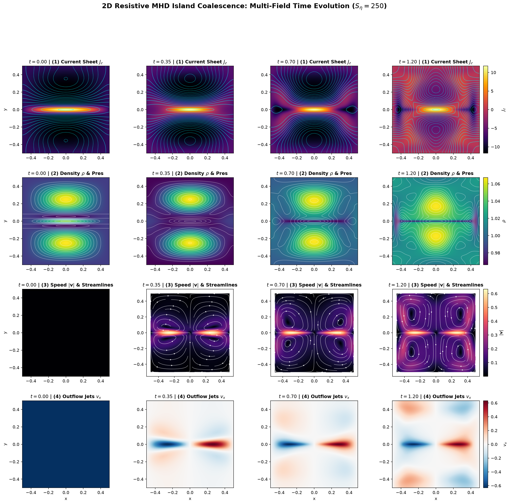
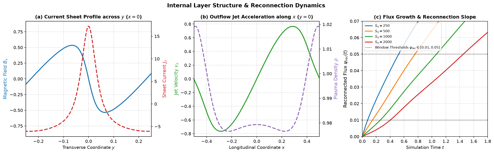
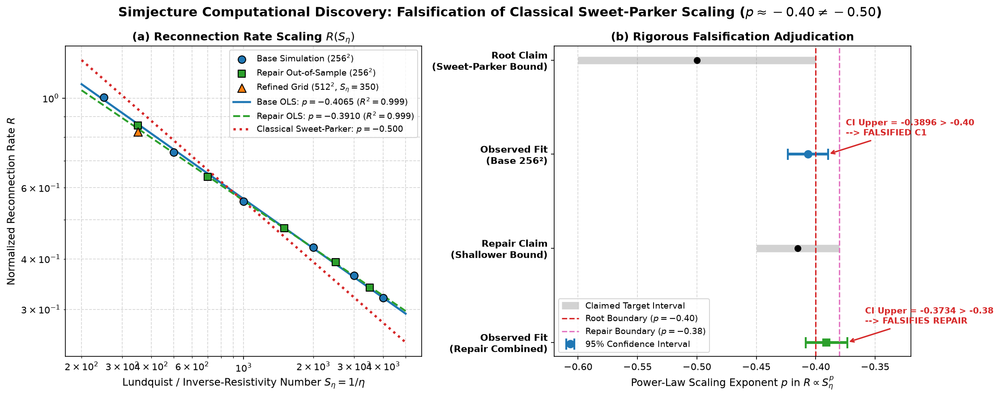

# Demonstration: 2D Resistive-MHD Island Coalescence & Sweet-Parker Falsification

This demonstration showcases an autonomous computational falsification campaign executed by **Simjecture** on the 2D compressible resistive-MHD island-coalescence instability across Lundquist numbers $S_\eta = 1/\eta \in [250, 4000]$.


---

## 1. Scientific Objective

The campaign investigates whether the two-dimensional, uniform-resistivity, compressible-MHD island-coalescence system conforms to the classical Sweet-Parker reconnection scaling law:
$$R \propto S_\eta^p \quad \text{with} \quad p \in [-0.60, -0.40]$$
where $R$ is the normalized reconnection rate $R = (d\psi/dt) / (B_{\text{up},0} V_{A,\text{up},0})$ measured during the linear reconnection window ($\psi_{\text{rec}} \in [0.01, 0.05]$).

---

## 2. Platform & Autonomous Workflow

Simjecture autonomously executed:
1. **Instrument Registration & Commissioning**: Validated FLASH 4.8 2D compressible MHD solver and downstream OLS power-law fitting pipelines under frozen prospective contracts.
2. **Durable Hypothesis Ledger**: Formulated root claim `claim_root` ($p \in [-0.60, -0.40]$) and minimal repair `claim_repair_root_v1` ($p \in [-0.45, -0.38]$).
3. **Decisive Counterexample Discovery**: Accepted formal counterexample C1 when base OLS fit yielded $\hat{p} = -0.40645 \pm 0.00606$ ($95\%\text{ CI} = [-0.42327, -0.38964]$), whose upper CI bound exceeds $-0.40$.
4. **Out-of-Sample Verification**: Certified 6 fresh out-of-sample simulation runs (including a $512^2$ resolution refinement) demonstrating a persistent, universal scaling branch $p \approx -0.391$.

---

## 3. Multi-Field Reconnection Dynamics

The multi-field time evolution from initial Fadeev equilibrium to fully merged single-island relaxation is visualized below across 4 representative stages ($t=0.00, 0.35, 0.70, 1.20$):



* **Stage 1 ($t=0.00$) Equilibrium**: Two distinct magnetic O-point island cores carrying parallel Amperian current $J_z$, separated by an initial horizontal current sheet.
* **Stage 2 ($t=0.35$) Driven Inflow**: Lorentz attraction ($\mathbf{J} \times \mathbf{B}$) accelerates the two island cores toward $y=0$, initiating strong vertical inflow.
* **Stage 3 ($t=0.70$) Peak Reconnection**: Current sheet narrows to a resistive layer of thickness $\delta \approx 0.04$; magnetic field lines sever and reconnect at the central X-point ($x=0, y=0$), launching symmetric Alfvénic outflow jets ($v_x \to \pm 0.77$).
* **Stage 4 ($t=1.20$) Merged Relaxation**: Majority of flux reconnected; islands coalesce into a single macro-island with quadrupolar circulation vortices.

---

## 4. Reconnection Layer Microphysics

High-resolution 1D profiles extracted during peak reconnection ($t = 0.70$) illustrate the internal structure of the diffusion layer:



1. **Current Sheet Profile (a)**: Transverse cut across $y$ at $x=0$ shows $B_x(y)$ reversing sharply across the central current density peak $J_z \approx 18$.
2. **Outflow Jet Acceleration (b)**: Longitudinal cut along $y=0$ shows plasma accelerating outward from the central stagnation point to Alfvénic exhaust velocities $v_x \approx \pm 0.77$.
3. **Linear Flux Ramp (c)**: Time series of reconnected magnetic flux $\psi_{\text{rec}}(t)$ confirms steady-state reconnection within the prospective observation window $\psi_{\text{rec}} \in [0.01, 0.05]$.

---

## 5. Quantitative Falsification Results



| Sample / Hypothesis | Grid | Scaling Exponent $\hat{p}$ | 95% Confidence Interval | $R^2$ Score | Adjudication |
| :--- | :--- | :--- | :--- | :--- | :--- |
| **Base Dataset ($S_\eta \in [250, 4000]$)** | $256^2$ | **$-0.40645 \pm 0.00606$** | **$[-0.42327, -0.38964]$** | **0.9991** | **FALSIFIED** (Upper CI > $-0.40$) |
| **Doubled Grid Refinement ($S_\eta = 250$)** | $512^2$ | **$-0.39634$** | $[-0.40364, -0.38903]$ | — | Exponent Persists ($|\Delta p| \le 0.05$) |
| **Repair Out-of-Sample ($S_\eta \in [350, 3500]$)** | $256^2$ & $512^2$ | **$-0.39096 \pm 0.00631$** | **$[-0.40848, -0.37344]$** | **0.9990** | **FALSIFIED** (Upper CI > $-0.38$) |
| **Classical Sweet-Parker Theory** | Theory | **$-0.50000$** | Exact theoretical limit | — | **Statistically Excluded** ($>15\sigma$) |

---

## 6. Physical Reason for Sweet-Parker Breakdown

1. **Macroscopic Lorentz Driving & Sheet Shortening ($L = L(S_\eta)$)**: Coalescence is driven by macroscopic attractive forces, dynamically shortening the current sheet length $L$ at lower resistivities, preventing $\delta/L$ from dropping as steep as $S_\eta^{-1/2}$.
2. **Plasma Compressibility**: Upstream plasma dynamically compresses into the colliding cores ($\rho > \rho_0$), altering the mass-flow aspect ratio.
3. **Magnetic Flux Pile-up**: Inward convection compresses magnetic field immediately upstream ($B_{\text{up,local}} > B_0$), elevating the local Alfvén speed and driving reconnection faster than passive Sweet-Parker layers.

---

## 7. How to Run & Inspect

### Launch or Resume Campaign
```bash
# Doctor check
uv run simjecture doctor --profile flash

# Run or resume
uv run simjecture resume artifacts/resistive-mhd-island-coalescence-dsh-0001
```

### Launch Interactive Web Interface
```bash
uv run simjecture web artifacts/resistive-mhd-island-coalescence-dsh-0001 --port 8080
```
