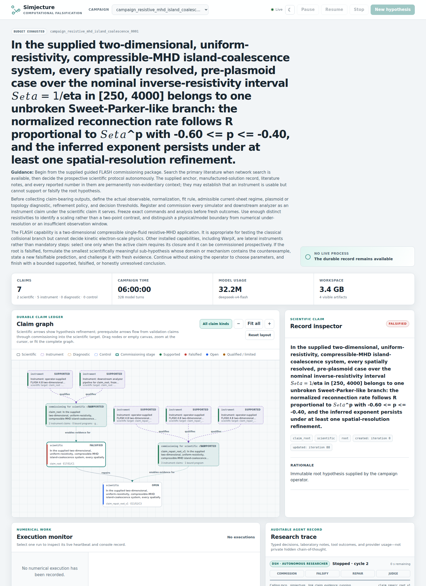

# Demonstration: 2D resistive-MHD island coalescence with FLASH

This demo has two deliberately separate layers:

1. a known-runnable, operator-validated FLASH 4.8 anchor used to commission an
   instrument and make field figures; and
2. an audit extract from a local Simjecture/DeepSeek campaign that tested a
   scaling hypothesis.

The anchor is not scientific evidence, and the campaign extract is not a
portable completed evidence record. The distinction is part of the demo: a
plausible simulation and a fitted curve are not, by themselves, a closed
scientific claim.



*Actual read-only browser capture of the local campaign after its six-hour
budget was exhausted. This is a UI projection, not scientific evidence.*

## Scientific question

The supplied root hypothesis asks whether the two-dimensional,
uniform-resistivity, compressible single-fluid MHD island-coalescence model
has one pre-plasmoid Sweet–Parker-like branch over the nominal control range

\[
S_\eta = 1/\eta \in [250,4000], \qquad
R \propto S_\eta^p, \qquad -0.60 \le p \le -0.40,
\]

with the inferred exponent persisting under a spatial-resolution refinement.
Here `S_eta` is a normalized inverse-resistivity control, not a dimensional
Lundquist number. The observable is the normalized reconnection rate defined
in the frozen campaign protocol; the fit uses only cases that reach the flux
window, resolve the sheet, remain pre-plasmoid, and pass the linearity check.

This is a statement about one explicitly bounded numerical model. A result
here is not a universal disproof of Sweet–Parker theory, and this FLASH
single-fluid capability cannot answer kinetic electron-scale questions.

## What is in the repository

| Path | Purpose |
| --- | --- |
| [`hypothesis.txt`](hypothesis.txt) | Exact natural-language root hypothesis |
| [`campaign_instruction.txt`](campaign_instruction.txt) | Operational constraints given to the autonomous campaign |
| [`guided/island_coalescence.py`](guided/island_coalescence.py) | Contained launcher and validator for the operator-supplied FLASH executable |
| [`guided_commission.json`](guided_commission.json) | Frozen guided-commission manifest and limitations |
| [`guided/anchor_validation.json`](guided/anchor_validation.json) | Checked-in validation summary; permanently non-evidentiary |
| [`guided/operator_validation.json`](guided/operator_validation.json) | Separate manufactured-solution/operator check; permanently non-evidentiary |
| [`campaign_audit.json`](campaign_audit.json) | Small, explicitly labelled extract of the local campaign results |
| [`plot_results.py`](plot_results.py) | Generates the field, profile, and scaling figures from real inputs |
| [`figures/README.md`](figures/README.md) | Figure provenance and capture notes |

The raw `guided/anchor_run/` directory is ignored by Git because FLASH output
is large and depends on the operator's installation. Run the anchor locally,
then run `plot_results.py` to regenerate the first three figures. The
dashboard image is a captured view of the actual local record; it is not a
mock-up.

## Guided FLASH anchor

The bundled manifest records the exact validated starting command. In its
realized run it used:

| Quantity | Realized value |
| --- | --- |
| Model | 2D compressible single-fluid resistive MHD |
| Resistivity | explicit, uniform, `eta = 0.001` |
| Nominal control | `S_eta = 1000` |
| Grid | `128 x 128` |
| MPI layout | 4 ranks (`2 x 2`) |
| End time | `tmax = 1.2` |
| Plot states | 24 HDF5 files |
| Flux window | `psi_rec = 0.01` to `0.05` reached |
| Maximum recorded `|div B|` | `9.36e-13` |
| Anchor status | `permanently_non_evidentiary` |

The anchor demonstrates that the supplied capability can run, write readable
states, expose the requested resistive path, and produce the declared
diagnostics. It does not establish a scaling, convergence, or physical law.

The operator must obtain and build FLASH under its upstream license. No FLASH
source, binary, or modification is redistributed here. Set the launcher and
executable explicitly, then run the contained program from the repository
root:

```bash
uv sync --extra flash-demo

export FLASH_EXECUTABLE=/path/to/flash4
export FLASH_MPI_LAUNCHER=/path/to/orterun

uv run python demos/resistive_mhd_island_coalescence/guided/island_coalescence.py \
  --eta 0.001 --nx 128 --ny 128 --alpha 20 --tmax 1.2 \
  --plot-interval 0.05 --ranks 4 --iprocs 2 --jprocs 2 \
  --output demos/resistive_mhd_island_coalescence/guided/anchor_run \
  --summary demos/resistive_mhd_island_coalescence/guided/anchor_validation.json \
  --overwrite

uv run python demos/resistive_mhd_island_coalescence/plot_results.py
```

The command rewrites only the marked anchor directory. The validation summary
records the executable and parameter-file hashes so the operator can audit
which local FLASH build produced the states.

## What the autonomous campaign actually established

The local campaign record is
`artifacts/resistive-mhd-island-coalescence-dsh-0001`. It ended with
`status=budget_exhausted` after six hours and 328 model turns. The durable
claim ledger, rather than the model's prose, is authoritative.

| Branch | Fresh-data result | Durable disposition |
| --- | --- | --- |
| `claim_root` | Six `256²` cases gave `p = -0.406453`; 95% CI `[-0.423266, -0.389641]`, whose upper edge is above `-0.40` | **Falsified** for the stated bounded root claim |
| Root refinement | The `S_eta=250`, `512²` context point gave a refined fit `p = -0.396338`; CI `[-0.403641, -0.389034]` | Context for the root branch; not evidence for the repair |
| `claim_repair_root_v1` | Audit fit over five `256²` cases plus the actual `S_eta=350`, `512²` run gave `p = -0.390961`; CI `[-0.408482, -0.373440]` | **Open**, not supported or falsified |

The root counterexample is meaningful: it rejects the particular exponent
interval in the particular model and protocol. The repair line is shown so a
reader can see what the campaign explored, not to claim a second discovery.
The original child contract requested a `S_eta=2000` refinement; the executed
high-resolution run was instead `S_eta=350`. In addition, the analyzer/fit
inputs did not pass the final sealed-input coverage check. Because the evidence
lineage was not closure-eligible, the harness correctly left the repair claim
open rather than promoting a curve to a verdict.

## Figures

The field and profile figures are generated from the actual guided anchor:

- [`island_coalescence_evolution.png`](figures/island_coalescence_evolution.png)
  shows four HDF5 states at the nearest recorded times to `0`, `0.35`, `0.70`,
  and the final state, with `J_z`, magnetic-flux contours, and field lines.
- [`reconnection_layer_physics.png`](figures/reconnection_layer_physics.png)
  shows `J_z`, density/pressure contours, and velocity at the recorded state
  nearest `t=0.70`.
- [`reconnection_microphysics_profiles.png`](figures/reconnection_microphysics_profiles.png)
  shows centerline cuts and the recorded flux-window/divergence history.

[`scaling_law_discovery.png`](figures/scaling_law_discovery.png) uses only the
checked-in audit extract. It is labelled as an audit view and leaves the
repair branch open. [`simjecture_web_dashboard.png`](figures/simjecture_web_dashboard.png)
is the actual browser capture described above.

## Launching a fresh campaign

After installing and commissioning FLASH on the local machine, a fresh
campaign can start from the same natural-language inputs:

```bash
uv run simjecture mvp \
  --hypothesis-file demos/resistive_mhd_island_coalescence/hypothesis.txt \
  --instruction-file demos/resistive_mhd_island_coalescence/campaign_instruction.txt \
  --guided-commission demos/resistive_mhd_island_coalescence/guided_commission.json \
  --output artifacts/my-resistive-mhd-campaign
```

Do not reuse the audit extract as evidence. Let the new campaign register and
commission its simulator and analyzer prospectively, freeze its contracts,
collect fresh outputs, and leave any unresolved branch explicitly open.

To inspect the local campaign shown in the screenshot without starting work:

```bash
uv run simjecture status artifacts/resistive-mhd-island-coalescence-dsh-0001
uv run simjecture web artifacts/resistive-mhd-island-coalescence-dsh-0001 \
  --read-only --port 8080
```

The web page is a projection of the durable ledger and activity record. It
does not turn the anchor, a plot, or model prose into scientific evidence.
