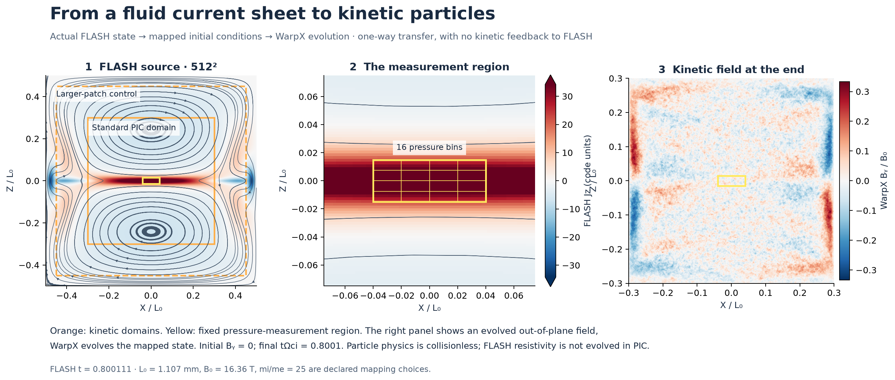
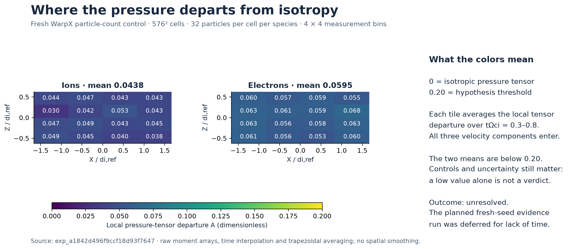
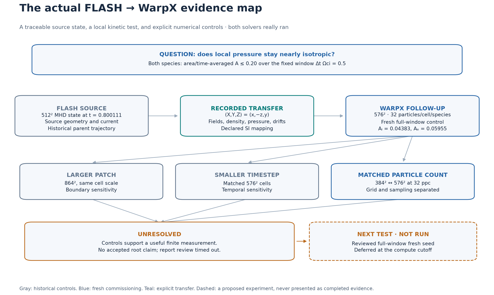
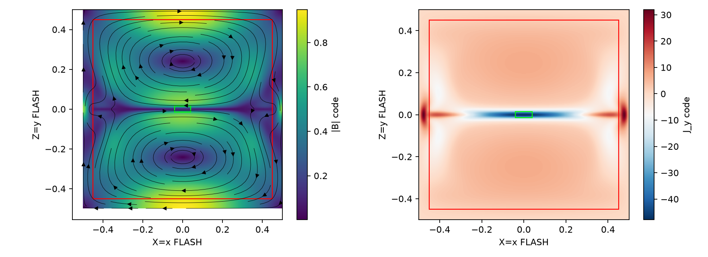
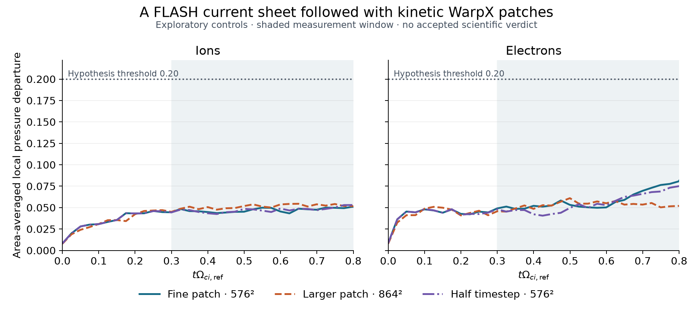

# From a FLASH current sheet to a kinetic WarpX patch

**Can a current sheet resolved by an MHD calculation remain nearly isotropic
when followed with kinetic particles at ion scales?** This two-hour study and its 30-minute continuation link
actual FLASH output to WarpX initial conditions, then tests pressure-tensor
behavior in a local region.

The transfer and numerical controls ran successfully. **The investigation ended
unresolved at its cutoff**, with no accepted scientific verdict. It demonstrates
a working, traceable two-solver investigation and its remaining qualification
gaps, rather than a validated general MHD closure.

## Follow the actual geometry



The left panel locates the standard and enlarged kinetic domains in the actual
FLASH source. The middle panel enlarges the fixed pressure-measurement region;
the grid shows its 16 spatial bins. The right panel shows the out-of-plane field
at the end of the fresh WarpX control. Boundary responses are visible near the
patch edges; the pressure observable applies to the yellow central region.
[Download PDF](../_static/demos/coupled-field-handoff.pdf) ·
[Open SVG](../_static/demos/coupled-field-handoff.svg).

FLASH evolves resistive fluid MHD. The local WarpX problem instead evolves
collisionless particles and electromagnetic fields. The handoff preserves a
recorded source state and declares the coordinate rotation and dimensional
mapping. It is a **one-way initial-condition transfer**: kinetic fields are not
fed back into FLASH.

## Look inside the pressure measurement



These tiles use the actual particle moments from the fresh $576^2$, 32-particle
control. Each averages the local three-component pressure-tensor departure over
$t\Omega_{ci}=0.3$–$0.8$; there is no spatial smoothing. The area/time means are
**0.04383 for ions and 0.05955 for electrons**, below the hypothesized 0.20 threshold.
The color scale retains that threshold so the size of the departure is visible.
[Download pressure-map PDF](../_static/demos/coupled-pressure-map.pdf).

The new run separates particle-count sensitivity from grid sensitivity. Its
matched-grid changes were 0.00411 and 0.00565; its fixed-grid particle-count changes
were 0.00319 and 0.00155 for ions and electrons. The recorded control checks pass,
but these are commissioning findings. The next prospective fresh-seed evidence
run could not fit the remaining compute allowance. **The original hypothesis
remains unresolved**, with no accepted claim verdict.

## Follow the evidence and the next test



Gray nodes preserve historical parent controls; blue nodes show fresh
commissioning. The dashed experiment is explicitly unrun. This map summarizes
recorded dependencies; it does not add a supported claim or an invented repair
to the formal claim graph. [Download evidence-map PDF](../_static/demos/coupled-evidence-map.pdf).

The 30-minute continuation completed five recorded jobs, including the 567-second
kinetic trajectory and the combined source/control analysis. Both directors
resumed useful worker preparation while simulations continued. At the end, the
coupled director deferred an unaffordable run and requested a quantitative report.
The report was written; its independent reviewer timed out before returning a
verdict. This is retained as a limitation of this trial, with subsequent repairs
in the [demo audit](../research/demo-audit-20261008.md).

| Follow a figure or result | Original record |
|---|---|
| Fresh kinetic control | [Execution receipt](../../demos/flash_warpx_kinetic_patch/continuation_record/experiments/exp_a1842d496f9ccf18d93f7647.json) |
| Source and control comparisons | [Combined analysis](../../demos/flash_warpx_kinetic_patch/continuation_record/experiments/exp_2170ea427cd8f5af2df39f06/workspace/analysis.json) |
| Figure arrays and source hashes | [Plotting provenance](../../demos/flash_warpx_kinetic_patch/visual_data/provenance.json) |
| Report review outcome | [Preserved finalization record](../../demos/flash_warpx_kinetic_patch/continuation_record/finalization.json) |

## The bounded question



*Agent-generated view of the actual $512^2$ FLASH source. The red rectangle marks
the enlarged kinetic domain; the green rectangle marks the pressure measurement
region. Coordinates and fields are normalized. This is recorded exploration.*


The operator supplied a resistive island-coalescence application and working
transfer helpers. GPT-6.1 Sol at high effort served as worker, with a separate
Sol-high review context. The agent chose a fresh source trajectory, source time,
physical mapping, local region, diagnostics and numerical controls.

The proposed observable is the local departure of each species' pressure tensor
from its isotropic part,

$$
A_s=\frac{\|P_s-\operatorname{tr}(P_s)I/3\|_F}
{\sqrt{3}\operatorname{tr}(P_s)/3}.
$$

The hypothesis requires its area/time average to remain at or below 0.20 for
both species, over a qualified interior window lasting at least
$0.5\,\Omega_{ci,\mathrm{ref}}^{-1}$. The chosen window was
$t\Omega_{ci,\mathrm{ref}}\in[0.3,0.8]$.

This is a finite initial-value problem: reduced mass ratio $m_i/m_e=25$,
initial $T_i/T_e=1$, and an explicitly chosen SI mapping. It does not test a
universal reconnection rate or radiation production. A small averaged tensor
departure alone also does not establish that the omitted tensor-gradient terms
are unimportant to the reconnection electric field.

## What actually connected the solvers

1. **FLASH:** fresh $256^2$ and $512^2$ trajectories from the supplied normalized
   resistive-MHD model. The selected fine snapshot is at code time 0.8001113920.
2. **Source qualification:** measured sheet half-width changed about 1.9% under
   refinement and spanned 7.41 fine source cells. Recorded density, pressure,
   magnetic-field and flow comparisons were inspected during methods review.
3. **Transfer:** the agent retained the source HDF5/NPZ identities, rotated
   $(X,Y,Z)=(x,-z,y)$, and transferred density, pressure, bulk flow and current.
   A discrete curl supplied the kinetic magnetic field. The recorded magnetic
   mapping discrepancy was approximately $3.25\times10^{-4}$ RMS.
4. **WarpX:** CUDA particle calculations evolved these transferred data, using
   paired neutral loading and species drifts that preserve center-of-mass flow
   while representing the current. The study collected local pressure tensors,
   fields, particle counts and energy diagnostics.

The relationship is **one-way initial-state transfer**. WarpX evolves a
collisionless model and does not retain FLASH's scalar resistivity. Neither
source resolution nor successful field transfer establishes kinetic equilibrium;
initial relaxation and boundary effects need separate checks.

## Numerical work and outcome



*Post-run editorial plot of the agent's preserved analysis arrays. The shaded
region is the declared measurement window. All curves are exploratory controls;
the original source and figures remain in the audit.*

| Control | Recorded result |
|---|---|
| Initial base/larger patches | Both reached the full window; approximately 7 and 13 minutes under concurrent GPU use |
| Particle count | Doubled particles on the coarse grid; the measured departure changed, so sampling could not be ignored |
| Fine patch | $576^2$, completed in 258 seconds after GPU layout optimization |
| Half timestep | Full window completed in 573 seconds |
| Matched enlarged domain | $864^2$ at the same physical cell size, completed in 554 seconds after batching particle loading |
| Final fresh-seed attempt | Cancelled by the worker after recognizing that completion plus review could not fit the remaining budget |
| Total executions | 32 succeeded, 6 failed, 2 cancelled, including preparation and analysis |
| Scientific disposition | Unresolved; no accepted claim review |

The final exploratory comparison reports average departures of approximately
0.047/0.058 for ions/electrons in the fine patch, 0.051/0.053 in the enlarged
domain, and 0.047/0.055 with half the timestep. These values are below 0.20, but
the study did not complete fresh reviewed validation and scientific adjudication.
The changed loader and fine-scale particle/seed qualification also required
explicit treatment; the coarse particle control is not automatically a complete
qualification of the finer grid.

Several failures were informative. The worker repaired installed-API and JSON
serialization errors, stopped an unaffordable concurrent refinement, reduced
GPU box overhead, and recovered from the enlarged loader's resident-memory
limit. The original worker report remained stale in places; final receipts and
the host's cutoff disposition take precedence over intermediate prose.

## Inspect and reproduce

The [demo sources and compact audit](https://github.com/tomzhu0225/simjecture/tree/main/demos/flash_warpx_kinetic_patch)
include the operator hypothesis, instructions, commissioned helpers, all 40
execution receipts, methods/director decisions and compact retained outputs.
The 581-file extract omits bulk fields, large transferred arrays and native
provider streams, with declared-artifact hashes preserved. It is not a complete
portable numerical replay package.

```bash
uv run python scripts/verify_research_audit.py demos/flash_warpx_kinetic_patch/record
uv run --extra flash-demo python demos/flash_warpx_kinetic_patch/plot_record.py
```

The first command verifies retained bytes and recorded dispositions without a
model call or installed solvers. The second redraws the pressure comparison from
the retained measurements. Fresh simulations require operator-supplied FLASH,
qualified WarpX and an agent backend.

The two-hour campaign launched from source commit
`32f500f2dcab29353f7943eb6205c24cd2e3d893`, a development checkout based on 0.6.0.
Reported native counters totalled 17,660,611 input tokens, including 15,668,992
cached tokens, and 131,631 output tokens. Six turns have incomplete reporting;
these are usage counters, not an invoice. Another research campaign used the
same machine during part of this run.

The design is motivated by
[Li et al. (2023)](https://arxiv.org/abs/2212.07980) and
[Makwana et al. (2017)](https://arxiv.org/abs/1708.02877). Those papers implement
embedded/two-way MHD–PIC approaches; this demo does not implement their coupling
algorithms or inherit their validation. See
[multi-tool studies](../how-to/multi-tool-studies.md) for the general handoff rules.
