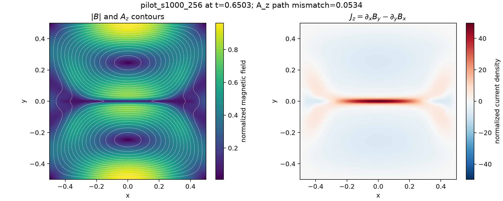
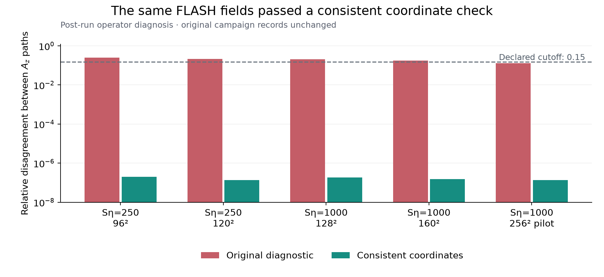

# Magnetic-island coalescence with FLASH

**Can one resolved reconnection-rate scaling describe a resistive-MHD island
coalescence model across its declared resistivity range?** This plasma example
connects a real FLASH simulation, field diagnostics, numerical qualification and
an autonomous attempt to test a scaling hypothesis.


*Preserved commissioning run: 2D FLASH 4.8, 128 × 128 cells, four MPI ranks,
uniform resistivity. These are actual computed fields. The commissioning run
establishes a working instrument; it is not evidence for a scaling law.*

## The physical question

The bounded model is two-dimensional, compressible, single-fluid resistive MHD
with uniform resistivity. The root claim proposes a pre-plasmoid branch

$$
R\propto S_\eta^p,\qquad -0.60\leq p\leq-0.40,
\qquad S_\eta=1/\eta\in[250,4000],
$$

that persists under spatial refinement. Here $S_\eta$ is the normalized
inverse-resistivity control used by this setup, not a dimensional Lundquist
number. The rate diagnostic, flux window, sheet resolution and branch eligibility
must be established before interpreting a fit. This single-fluid model does not
resolve electron-scale kinetic reconnection.

## The classic campaign remains available

The [original demo](https://github.com/tomzhu0225/simjecture/tree/main/demos/resistive_mhd_island_coalescence)
retains the guided input, plotting code, field and profile figures, a real GUI
capture and the six-hour campaign's audit extract. No original figure or record
has been replaced by the refreshed documentation.

That campaign recorded the root as falsified and left its repair open. The later
audit identified an important interpretation error: the root's reported 95%
interval, $[-0.423266,-0.389641]$, overlaps the proposed exponent band. An upper
edge above $-0.40$ does not, by itself, reject the whole band. The repair also
missed its specified refinement case and failed final analysis-lineage checks.
Read the original record together with its appended correction.

This is a useful example of why a convincing field plot, a regression and a
recorded verdict need to be assessed separately. The historical audit extract
is not a portable, completed scientific evidence package.

## The fresh one-hour minimal run

**The refreshed study ended unresolved at its one-hour cutoff. It did not
establish a new reconnection-rate scaling.** It used the same original physical
hypothesis and FLASH executable, with GPT-6 Luna at medium effort as worker and
GPT-6.1 Sol at high effort in the separate review context.



*Fresh $256^2$ commissioning trajectory at $t=0.6503$, rendered by the agent from
its recorded fields. The picture is exploratory; it is not accepted evidence for
the scaling hypothesis. Its title retains the original path-error diagnostic;
see the post-run correction below. The earlier field figures above remain unchanged.*

The reviewer requested three rounds of methods revisions before approving a
production method. It identified gauge-sensitive topology/flux diagnostics,
incomplete-measurement handling, uncertainty propagation and the rule for
comparing refinement results. The worker preserved those decisions and revised
its sources; approval of a method did not establish the physical claim.

| Part of the record | Observed outcome |
|---|---|
| Recorded executions | 25 succeeded, 5 failed, 1 was cancelled; these include analysis and qualification jobs as well as simulations |
| Fresh complete evidence trajectories | $S_\eta=250$ at $96^2$ and $120^2$; $S_\eta=1000$ at $128^2$ and $160^2$ |
| Diagnostic eligibility | The four complete cases failed the declared flux-potential path-consistency screen |
| Low-resistivity endpoint | $S_\eta=4000$, $256^2$: cancelled after partial evolution; it had not reached the full measurement window |
| Scaling and refinement verdict | No eligible fresh scaling dataset; no scientific claim accepted |

The larger $S_\eta=1000$, $256^2$ pilot passed the local diagnostic screen, but it
was commissioning/exploration. It could not be relabelled as fresh claim evidence.
The incomplete $S_\eta=4000$ trajectory was censored, not treated as a physical
counterexample. Much of the budget went into diagnostic development and review;
the final record does not distinguish the exponent band with qualified data.

The campaign's ineligibility decisions are preserved, but a subsequent operator
check identified a defect in the diagnostic itself, described below. The rejected
cases should not be interpreted as evidence that FLASH failed to resolve the field.

### Post-run correction: a half-cell error in the diagnostic

**The agent's two-path check mixed a cell-centre gauge with an integration starting
at the lower cell boundary.** Its vertical path included an extra half-cell
contribution. The horizontal path used the first cell-centre row, so the two
paths did not represent the same coordinates. The worker's qualification fixture
and independent methods review missed the error.

A separate post-run calculation applied consistent quadrature to the *same*
retained fields. It compares the average potential on the two central cell-centre
rows along both paths; it is not an exact continuum evaluation at $y=0$.

| Case | Original maximum discrepancy | Consistent-coordinate discrepancy |
|---|---:|---:|
| $S_\eta=250$, $96^2$ | 0.248636 | $1.98\times10^{-7}$ |
| $S_\eta=250$, $120^2$ | 0.217575 | $1.37\times10^{-7}$ |
| $S_\eta=1000$, $128^2$ | 0.202556 | $1.86\times10^{-7}$ |
| $S_\eta=1000$, $160^2$ | 0.177381 | $1.50\times10^{-7}$ |



An independent analytic field, $A_z=x(y^2+0.005)$, exposes the same problem:
the original formula reports a discrepancy of about 1.04 on a $96^2$ grid,
while the corrected paths match the exact row-average potential to roundoff.
The regression tests include unequal cell spacings and a shifted coordinate origin.

This correction explains the false path-screen rejections. It does **not** supply
the missing resistivity coverage, certify the remaining diagnostics, or create an
accepted scaling claim. The original sources, receipts, methods decisions and
report remain unchanged. The new check is explicitly operator-authored, after
termination; it is not attributed to the autonomous worker.

Run the analytic check without a solver, raw FLASH files or a model call:

```bash
uv run python demos/resistive_mhd_island_coalescence/postrun_coordinate_check.py
```

The [check report and source](https://github.com/tomzhu0225/simjecture/tree/main/demos/resistive_mhd_island_coalescence)
retain archive hashes and the five-case numerical comparison, including the
commissioning pilot. Rechecking those raw fields requires the original local
archives via `--study PATH`; the compact Git extract does not include them.
This is a concrete contribution opportunity: validated coordinate-aware diagnostics
can prevent an agent and its reviewer from repeatedly reasoning over a flawed test.

### Inspect the audit

The [minimal-run extract](https://github.com/tomzhu0225/simjecture/tree/main/demos/resistive_mhd_island_coalescence/minimal_record)
contains all execution receipts, methods decisions, director records, retained
source and compact outputs. It preserves the original worker report without
rewriting its conclusion. Bulk FLASH histories and native provider sessions are
omitted, with declared-file hashes recorded; this is a compact audit rather than
a complete numerical replay package.

```bash
uv run python demos/resistive_mhd_island_coalescence/verify_minimal_record.py
```

This checks retained-file integrity and recorded dispositions, without FLASH or
a model call. It does not independently reanalyse the omitted HDF5 histories.
The completed [Kepler investigation](kepler-energy.md) provides a smaller record
with full retained arrays and a no-key numerical reproduction path.

The exact source commit was `09ddd7a51387124b5e2ed38d254f76b601f9aa11`, a development
checkout based on 0.6.0 with the ancestor-review scheduling fix. The manifest fixes
that identity independently of future releases. Reported native counters totalled
57,726,924 input tokens, including 56,304,384 cached tokens, and 240,213 output
tokens. Ten turns have incomplete usage reporting; these counters are not an
invoice. A separate CUDA compilation overlapped part of the run, so its wall time
is not a controlled comparison with another model or campaign.

## Reproduce the instrument or contribute a stronger test

The original demo provides the exact commissioning command and plotting script.
FLASH source and binaries are supplied by the operator under their upstream
license; they are not distributed with this repository. A fresh study must
commission the executable through its actual experiment launcher and retain
its own inputs, diagnostics and evidence.

To start a separate minimal-mode study from a source checkout, point
`--capabilities` to the directory containing your qualified island-coalescence
capability. Select your worker and reviewer models; the recorded one-hour run
used the routes shown here:

```bash
uv run simjecture study \
  --campaign artifacts/my-island-minimal \
  --hypothesis-file demos/resistive_mhd_island_coalescence/hypothesis.txt \
  --instructions-file demos/resistive_mhd_island_coalescence/minimal_instructions.txt \
  --requirements-file demos/resistive_mhd_island_coalescence/minimal_requirements.json \
  --guided-commission demos/resistive_mhd_island_coalescence/guided_commission.json \
  --capabilities /path/to/qualified/capabilities \
  --backend codex --model gpt-6-luna --reasoning-effort medium \
  --judge-model gpt-6.1-sol --judge-reasoning-effort high \
  --mode minimal --completion-policy repair --wall-seconds 3600 --director
```

A new campaign consumes model usage and produces new evidence; its transcript
and outcome need not match the recorded study. Its budget must include diagnostic
qualification, numerical controls and review, as well as solver execution.

Useful extensions include a justified rate diagnostic, spatial/time convergence,
branch qualification and a clearer test of the proposed scaling interval.
Start with [guided commissioning](../how-to/guided-commissioning.md) and
[the evidence rules](../concepts/evidence-and-claims.md).
