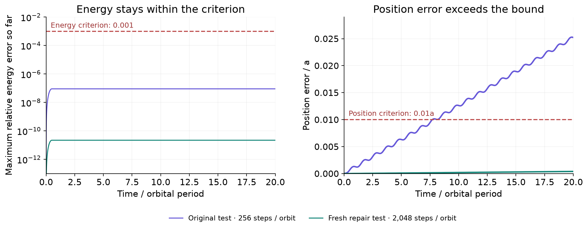

# Does energy conservation guarantee an accurate orbit?

**The original claim was falsified. A narrower, prospectively committed claim
passed independent review after four fresh numerical experiments.** The study
finished in 6 minutes 40 seconds, within its 20-minute budget.

This is a small, inspectable example of the [counterexample-and-repair loop](../concepts/research-loop.md).
It reproduces a numerical pitfall in ordinary CPU Python: small energy error can
coexist with a growing orbital phase error. Its purpose is to expose the research
process, rather than claim a new result in celestial mechanics.



*Circular orbit, twenty periods. These curves were drawn after the investigation
from its preserved arrays. The violet curve is an original counterexample;
the green curve is one fresh validation case for the revised claim.*

## The question and the counterexample

The operator specified a planar Kepler problem with $GM=a=1$, a periapsis start,
and a kick–drift–kick leapfrog integrator. The original domain was the twelve
combinations of eccentricity $e\in\{0,0.3,0.6\}$ and
$N\in\{64,128,256,512\}$ steps per orbital period, integrated for twenty periods.

The hypothesis was an implication: if the maximum sampled relative energy error
stays below $10^{-3}$, the maximum position error at the same times stays below
$0.01a$.

The agent implemented the solver, checked an exact Kepler reference against an
independent high-accuracy integration, and ran the full twelve-case matrix. Six
cases met the energy criterion; **five of those violated the position bound**.
One particularly clear example is:

| Circular orbit, 256 steps per period | Measured maximum | Proposed bound |
|---|---:|---:|
| Relative energy error | $9.06374\times10^{-8}$ | $10^{-3}$ |
| Position error / $a$ | $0.0252822$ | $0.01$ |

The reviewer checked the source, retained trajectories, leapfrog update,
invariants and the analytic circular reference. It accepted the root falsification
in `review_9e9e9a5528a825b402183851`, based on
`exp_70ff32e6d28ef9ccd7312295`.

## What changed, and what was tested again

The repair replaced the energy-only implication with explicit resolution and
position-accuracy requirements for **four named cases**. It was recorded before
the validation runs. The agent also corrected an initial command binding before
running the tests; both commitments remain in the record.

| Eccentricity | Steps per period | Maximum position error / $a$ | Maximum relative energy error |
|---:|---:|---:|---:|
| 0 | 2,048 | 0.000395134 | $2.22\times10^{-11}$ |
| 0.3 | 2,048 | 0.00154621 | $5.12\times10^{-6}$ |
| 0.6 | 4,096 | 0.00642788 | $1.74\times10^{-5}$ |
| 0.6 | 8,192 | 0.00160695 | $4.36\times10^{-6}$ |

All four met the committed limits. A separate challenge at $e=0.6$, $N=2048$
failed the position requirement despite passing the energy criterion. That case
lies outside both the original twelve-case matrix and the revised four-case
claim; it is useful context, not a counterexample to the accepted repair.

The reviewer accepted the repair in `review_91da2f71f73cfdcb1b8e34d6`. Its support
is limited to these cases and sampled times. The record establishes neither a
minimum resolution rule nor accuracy for every eccentricity or future time.

## Inspect or reproduce it

The [source record](https://github.com/tomzhu0225/simjecture/tree/main/demos/kepler_energy)
contains the operator's hypothesis and instructions, six experiment receipts,
original numerical code and arrays, both commitments, both reviews and the
generated study ledger. No API key is needed to inspect it.

From a repository checkout, verify the retained hashes, numerical measurements
and review/commitment relationships:

```bash
uv sync --frozen
uv run python demos/kepler_energy/verify_record.py
```

Rerun the original twelve-case experiment into a new directory:

```bash
uv run python demos/kepler_energy/reproduce.py \
  --experiment exp_70ff32e6d28ef9ccd7312295 \
  --output artifacts/kepler-reproduction
```

This executes the retained numerical program; it does not call an agent or create
a new accepted scientific verdict. To start your own autonomous investigation,
follow [the first-study tutorial](../getting-started/first-run.md).

## Who did what, and what it cost

The operator supplied the question, original finite domain, reference checks and
budget. **GPT-6 Luna, medium effort**, implemented the numerical work and chose
the repairs and follow-up experiments. **GPT-6.1 Sol, high effort**, reviewed in a
separate context. The host recorded the experiments and enforced fresh evidence
for committed repairs. The explanatory figure and this page were prepared after
the run; they do not replace its original record.

The run used minimal mode with the `repair` completion policy and source commit
`09ddd7a51387124b5e2ed38d254f76b601f9aa11`, a development checkout based on
0.6.0 with the ancestor-review scheduling fix. Python, dependency and model
identities are frozen in `record/manifest.json`; future package releases do not
change this study's identity.

The six numerical jobs took about 13 seconds in total. The 400-second campaign
also includes agent reasoning, tool calls and review. Native session counters
reported 1,526,631 input tokens, including 1,382,016 cached input tokens, and
17,834 output tokens. Two turns have incomplete usage reporting, so these
counters are not a complete billing statement. OAuth usage is not converted into
a hypothetical dollar charge.

An earlier attempt exposed a harness defect: a repair review was scheduled before
its parent falsification, repeatedly rejected at the ancestor gate, and retried.
The operator stopped that attempt, fixed the dependency ordering, and launched
this study in a new directory. The manifest preserves the failed attempt's
summary; it is not counted as part of the successful run's time or usage.

The agent's `research/RESULTS.md` was written before the final review and still
mentions a pending check. It is preserved verbatim. The accepted review receipts
and `research_report.json` record the completed outcome.
