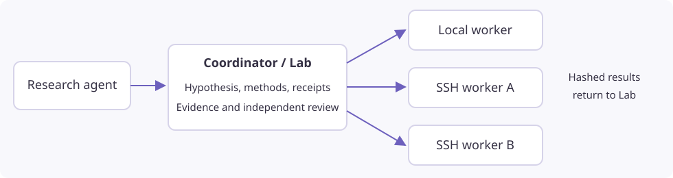

# Run experiments on local and SSH workers

Execution pools extend minimal-mode studies with local and SSH numerical
workers. Install the current stable workspace or matching Python package on the
coordinator.

One Simjecture workspace owns the research agent, hypothesis, methods, reviews,
experiment receipts and deadline. Each selected machine runs a headless execution
worker. A worker needs Python and the numerical runtime, but no model subscription,
provider key, web server or copy of the research supervisor. Local and SSH workers
share the same versioned execution protocol and numerical launcher.



## Prepare through the workspace

1. Open **Machines → Add machine**. Enter an SSH address and password, then
   click **Connect & prepare**. Addresses can be a normal command such as
   `ssh -p 23 root@host`, `user@host:port`, `ssh://user@host:port` or an SSH config
   alias. An empty password uses your existing key/SSH agent.
2. Preparation runs in the background. It detects the login account, visible
   CPU/RAM/GPU resources, chooses conservative budgets and a persistent worker
   directory, installs private Python 3.12, and verifies the numerical launcher.
   Root logins prepare an unprivileged `simjecture` worker account. Bubblewrap is
   preferred; restricted containers select cooperative PRoot only when its probe succeeds
   under the unprivileged worker account. If both backends are blocked, preparation
   fails with a setup error. Root
   Debian/Ubuntu hosts can install the missing execution dependency. Other hosts
   show an actionable setup error when installation needs additional privileges.
3. **Advanced settings** are optional. Override the display name, directory,
   resource budget, GPU IDs, execution environment, key path or instrument
   directories. Blank resource fields mean automatic detection; `none` in GPU IDs
   explicitly chooses CPU-only execution. Existing manual installations retain
   their paths and budgets when you edit settings.
4. Machine cards show **Online**, **Offline**, **Preparing**, setup errors or stale
   checks, plus resource budgets, active jobs and the last-check age. The server
   sends lightweight heartbeats every **30 seconds**, even when no browser is open.
   Heartbeats do not launch numerical jobs or rehash solver installations. Refresh
   checks availability immediately. A study launch still performs its full checks.
5. **Prepare with agent** opens a setup conversation with the registered machine
   selected. Choose your agent/model and send the prepared request. The agent can
   inspect the host, prepare the managed worker, run recorded SSH setup commands,
   and register actual instrument descriptor directories using the saved connection.
   Passwords are not placed in its prompt or tool arguments. Native CLI agents use
   the same workspace Python bridge. Scientific solvers, source views and tables
   must be registered on the worker; worker preparation does not download FLASH or
   copy licensed tables between machines. The worker account needs read/traverse
   access to every registered runtime and mount.
6. In **Autonomous research**, select the prepared workers under **Experiment
   machines**. Use minimal mode. **Add this computer** provides a managed local
   worker with one click. An empty study selection retains the existing local
   execution path. Machine **Jobs** shows readable receipts and cancellation controls.

Basic onboarding enrolls a new host key into a private, coordinator-managed
`known_hosts` file on first connection; subsequent key changes are rejected.
Existing manually configured SSH profiles retain strict pre-enrolled host-key checks.

The study and monitor show placement, remote job ID, GPU assignment and unreachable
transport. Declared outputs appear in study results; recorded files held remotely
have a **Retrieve** action. Direct and agent-guided continuation preparation retain
registered machine selections. You can change the selection before launching the
new phase. Register the parent's machine IDs first when importing an external study.

## Prepare through the CLI

Install `simjecture[workspace]` on the coordinator.
This includes the process monitor and the built-in API agent used in the example.
A coordinator using only native CLIs can use the smaller `process` extra; managed
local workers also need the process monitor.
Create `node-a.json`, substituting your host, login, paths and capacity:

```json
{
  "id": "node-a",
  "label": "GPU workstation",
  "kind": "ssh",
  "host": "compute.example.org",
  "port": 22,
  "user": "research",
  "root": "/home/research/simjecture-worker",
  "python": "python3",
  "config": {
    "execution_backend": "bubblewrap",
    "cpus": 8,
    "memory_mb": 16384,
    "gpu_ids": ["0", "1"],
    "max_jobs": 2,
    "capabilities": ["/home/research/capabilities"]
  }
}
```

```bash
simjecture machines --registry ./machines add --file node-a.json
simjecture machines --registry ./machines prepare node-a
simjecture machines --registry ./machines check node-a
simjecture machines --registry ./machines status node-a

simjecture study --campaign ./runs/parallel-study \
  --hypothesis-file hypothesis.txt --instructions-file instructions.md \
  --mode minimal --backend builtin --model YOUR_MODEL \
  --provider-config /private/provider.json --wall-seconds 3600 \
  --machine-registry ./machines --machine node-a --machine node-b
```

Add and prepare `node-b` before selecting it. To include the coordinator as a
managed execution worker, register `kind: "local"` with an absolute worker root
and the Python executable from its installed environment.

Optional profile fields are `identity_file`, `known_hosts`, `control_path` and
`run_as`. OpenSSH multiplexing reuses connections automatically when no control
socket is supplied. Password authentication is supported; saved passwords stay in
mode-0600 private coordinator files, outside profiles and study manifests. Prefer
the GUI password field over putting a credential in a shell command or profile file.

## Submit and inspect experiments

The generated `lab.py` client exposes the pool without changing hypothesis or
review rules:

```python
from lab import lab
print(lab.machines())

receipt = lab.run(
    "calculation.py",
    inputs=["input.json"],
    outputs=["result.json", "figure.png"],
    capability="warpx-cuda--at-node-a",
    stage="exploration",
    resources={"cpus": 2, "memory_mb": 4096, "gpus": 1},
    timeout=600,
    key="commission-1",
)
print(lab.status())
```

Use an alias advertised by `lab.machines()`. An alias is bound to its worker;
plain Python jobs choose a worker automatically unless `machine="node-b"` is
specified. Submit multiple asynchronous jobs to obtain parallel execution.
Requests queue when their CPU/RAM/GPU reservation or concurrency slot is busy.
GPU IDs are distinct physical devices, verified at readiness. Assigned devices
set `CUDA_VISIBLE_DEVICES`; CPU-only jobs receive an empty value. A CUDA capability
must mount all devices that may be allocated to it. CPU counts are admission
reservations, not OS CPU quotas; request enough cores for MPI ranks and threads.

For single-node Open MPI, launch through the installed helper inside the experiment:

```python
import os, subprocess, sys
subprocess.run([
    sys.executable, os.environ["SIMJECTURE_MPI_HELPER"],
    "--ranks", "16", "--", "./flash4",
], check=True)
```

Request `resources={"cpus": 16, "memory_mb": 49152, "gpus": 0}` for that example.
The helper supplies the reserved localhost slots and rejects excess ranks rather
than oversubscribing. It covers single-node Open MPI, not distributed MPI or other
MPI implementations. A successful one-rank smoke test does not qualify a 16-rank
launch: commission the exact worker, rank count, runtime and input bundle.

Source and dependency views are read-only. Inspect them through the bounded helper:

```python
lab.read_instrument(capability="flash--at-node-a", root="runtime", path=".")
lab.read_instrument(
    capability="flash--at-node-a", root="runtime",
    path="source/Simulation/SimulationMain/example.F90", max_bytes=16000,
)
lab.fetch_remote(experiment=receipt["id"], path="diagnostics/fields.h5")
```

Choose a registered `readable_roots` entry for a source mount. Only declared outputs,
input programs and small text diagnostics are imported automatically. Other recorded
arrays remain on the worker until explicitly retrieved. Transfers are chunked and
SHA256-verified; a solver exit or a transferred file never grants scientific approval.
Large explicitly declared outputs are transferred even when they are arrays.

On filesystems with unstable directory inodes, the operator can provide a
`.simjecture-source-manifest.json` inside a reference dependency root. It maps
declared source paths to SHA256 hashes. The harness verifies every listed file's
bytes and uses the manifest content as identity instead of device/inode numbers.
Keep the manifest and reference root protected by host permissions. It covers the
listed files, not unlisted additions. Symlink escapes, changed bytes and malformed
hashes fail validation. Introducing it changes the capability identity: qualify a
new phase/profile rather than changing an existing frozen study. Legacy references
without it retain their existing identity semantics.

## Recovery, deadlines and boundaries

Job identity includes a persistent study UUID and the frozen experiment request.
Lost upload/submission replies replay the same job. A coordinator restart reattaches
to its detached worker process. An unreachable SSH transport remains distinct from
an experiment failure; restored credentials or connections recover the existing job.

Queueing and network waits count against the original absolute study deadline.
Workers enforce that deadline without the coordinator. If it expires while SSH is
unreachable, the coordinator records an unconfirmed stop rather than claiming a
verified cancellation. Explicit cancellation terminates recorded descendants and
retains reservations while stopping is unconfirmed. A worker crash produces an
interrupted receipt; a reboot does not silently rerun the same job.

Worker code, configuration, identity and runtime hashes are frozen for the phase.
Keep old worker program generations and job directories for retrieval. Drain active
jobs before changing worker configuration; changing routing requires draining active
studies. Renewing authentication does not change experiment identity. Use a new phase
to select changed workers or instruments.

Restricted GPU containers may require explicit `proot-cooperative` selection. It
provides filesystem views and execution limits, but no kernel or network isolation;
use trusted workers and programs. Native agent tools remain available on the
coordinator. This feature currently covers minimal-mode numerical experiments;
interactive chat simulations, remote agent hosting and Slurm submission are separate
paths.

For a trusted host where PRoot interferes with MPI, **Machines → Settings → Advanced
settings → Experiment environment → Native process** explicitly selects
`process-cooperative`. This runs under the unprivileged worker account with host
filesystem and network access. It retains frozen-input checks, deadlines, sampled
aggregate RSS limits and receipts, but supplies no OS isolation. Registered runtime
and source files need host permissions to remain read-only. Automatic detection does
not select this backend. See [restricted hosts](restricted-containers.md).

Earlier studies retain their frozen backend and worker configuration when
the coordinator is upgraded.

Create a separate machine profile and worker root when changing an execution
backend that old studies have frozen. Keep the original profile and program generation
for retrieval. Profiles for the same SSH address/port share physical capacity: a study
cannot select both, and an active reservation on either prevents allocating through
the alternative. DNS aliases are not resolved into one physical-host identity.

## Relationship to Simote

Simote and Simjecture remain independently usable. This pool uses ordinary OpenSSH
and can run from a coordinator deployed by Simote. It does not require a master/slave
Simote installation or a second research scheduler. Existing Simote agent-role and
Slurm integrations remain separate; this change does not add a Simote profile importer
or a Slurm worker adapter. See [Simote agent roles](simote-agent-roles.md).

See the [two-host acceptance record](../testing/ssh-workers-acceptance.md) for the
actual numerical, solver, recovery and interface checks.
