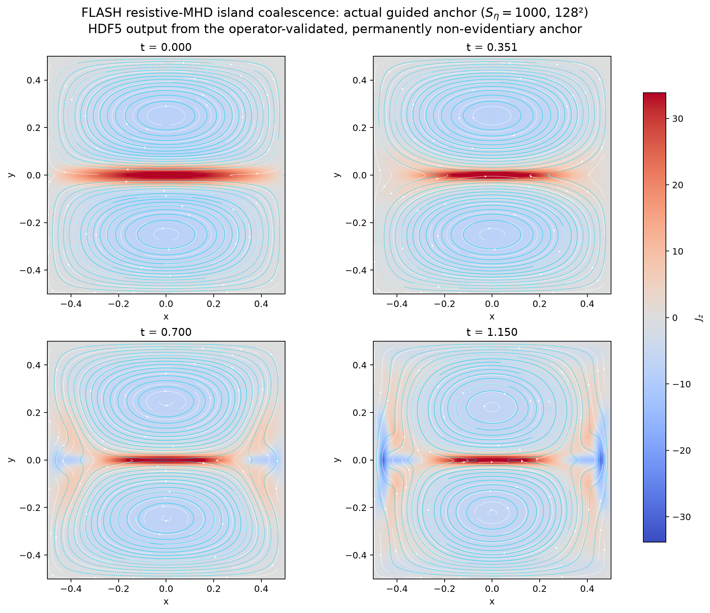

# Autonomous research with inspectable evidence

```{raw} html
<p class="sj-eyebrow">Simjecture · Autonomous numerical research</p>
<p class="sj-lead">Bring a hypothesis and the conditions that matter. Let an agent design experiments, search for counterexamples and test a better explanation—with recorded evidence and independent review.</p>
<div class="sj-actions">
  <a class="sj-button primary" href="getting-started/first-run.html">Run your first investigation →</a>
  <a class="sj-button" href="demos/index.html">Explore recorded studies</a>
  <a class="sj-button" href="https://simjecture.com">Try online ↗</a>
</div>
```

## How research moves forward

```{raw} html
<ol class="sj-loop">
  <li><strong>Frame the question</strong><span>You and the agent agree on the hypothesis, physical scope and budget.</span></li>
  <li><strong>Run experiments</strong><span>The agent chooses methods and runs recorded numerical computations.</span></li>
  <li><strong>Look for a failure</strong><span>Challenge the prediction and check candidate counterexamples.</span></li>
  <li><strong>Commit a repair</strong><span>Preserve the failed claim and state a justified replacement before testing it.</span></li>
  <li><strong>Collect fresh evidence</strong><span>Run the committed tests and challenge the revised prediction.</span></li>
  <li><strong>Review the conclusion</strong><span>A separate context examines the claim, source, results and numerical controls.</span></li>
</ol>
<p class="sj-loop-note">Review gaps return the agent to investigation. Human steering can change the next experiment. The selected completion policy determines whether a falsification finishes the study or starts a repair; the deadline can leave it incomplete.</p>
```

[Understand the loop](concepts/research-loop.md) ·
[See what counts as evidence](concepts/evidence-and-claims.md)

## See the process in a real record

The [FLASH island-coalescence study](demos/island-coalescence.md) asks whether
one reconnection-rate scaling survives changes in resistivity and resolution.
Follow real plasma fields, the original campaign's audit and a fresh minimal-mode
investigation.



For a short, fully inspectable example, the
[orbital-accuracy investigation](demos/kepler-energy.md) found five counterexamples
and supported a narrower claim with fresh numerical tests and independent review.
Ordinary CPU Python is enough to reproduce its experiments.

The [FLASH-to-WarpX investigation](demos/flash-warpx-patch.md) connects a measured
MHD current sheet to local kinetic calculations. It records successful state
transfer and completed numerical controls, with the scientific claim unresolved
at the two-hour cutoff.

```{raw} html
<div class="sj-cards">
  <a class="sj-card" href="getting-started/first-run.html"><span class="sj-label">Start investigating</span><strong>From a conversation to a tested claim</strong><p>Prepare a brief, choose a completion policy and follow a study through experiments and review.</p></a>
  <a class="sj-card" href="concepts/evidence-and-claims.html"><span class="sj-label">Understand the record</span><strong>Why should you trust this result?</strong><p>Trace a conclusion to its numerical inputs, outputs, counterexamples and review decisions.</p></a>
  <a class="sj-card" href="how-to/guided-commissioning.html"><span class="sj-label">Bring a scientific tool</span><strong>Start from a working instrument</strong><p>Give the agent a verified example, source access, diagnostics and clear physical limits.</p></a>
  <a class="sj-card" href="how-to/continuation-steering.html"><span class="sj-label">Keep exploring</span><strong>Guide the next experiment</strong><p>Steer at a checkpoint or open a linked continuation with a revised brief and new budget.</p></a>
</div>
```

## Choose your working environment

Use [the hosted workspace](https://simjecture.com) with supplied inference and
compute within usage limits, or [install locally](getting-started/installation.md)
and choose your own API or native CLI agent. You can run ordinary Python studies,
add scientific capabilities, and use [SSH workers](how-to/ssh-workers.md) for
numerical experiments. [Server mode](how-to/public-trials.md) supports an operated
service with per-visitor allowances.

The sidebar identifies the documentation build version. Current walkthroughs and
historical records are labelled separately. See [research status](research/status.md),
[release checks](archive/index.md), or
[contribute a tool or study](https://github.com/tomzhu0225/simjecture/blob/main/CONTRIBUTING.md).

```{toctree}
:hidden:
:caption: Start here

concepts/research-loop
getting-started/installation
getting-started/first-run
getting-started/research-workspace
```

```{toctree}
:hidden:
:caption: Research records

demos/index
demos/island-coalescence
demos/flash-warpx-patch
demos/kepler-energy
demos/gray-scott
demos/collisionless-gem
```

```{toctree}
:hidden:
:caption: Understand the system

concepts/evidence-and-claims
concepts/architecture
research/limitations
research/status
```

```{toctree}
:hidden:
:caption: Work with Simjecture

how-to/headless-studies
how-to/projects-and-workspaces
how-to/research-service
how-to/continuation-steering
how-to/minimal-oversight
how-to/research-memory
getting-started/web-interface
getting-started/terminal-ui
```

```{toctree}
:hidden:
:caption: Tools and deployment

how-to/guided-commissioning
how-to/multi-tool-studies
how-to/add-a-capability
how-to/deploy-runtimes
how-to/iter-pack
how-to/cylinder-flow
how-to/ssh-workers
how-to/restricted-containers
how-to/public-trials
how-to/llm-bench
how-to/deepseek-harness
how-to/simote-agent-roles
```

```{toctree}
:hidden:
:caption: Reference and contributing

reference/cli
reference/repository-map
development/contributing
development/documentation
development/releasing
archive/index
```
