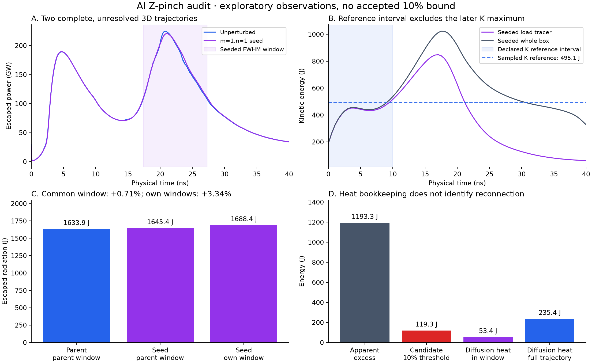
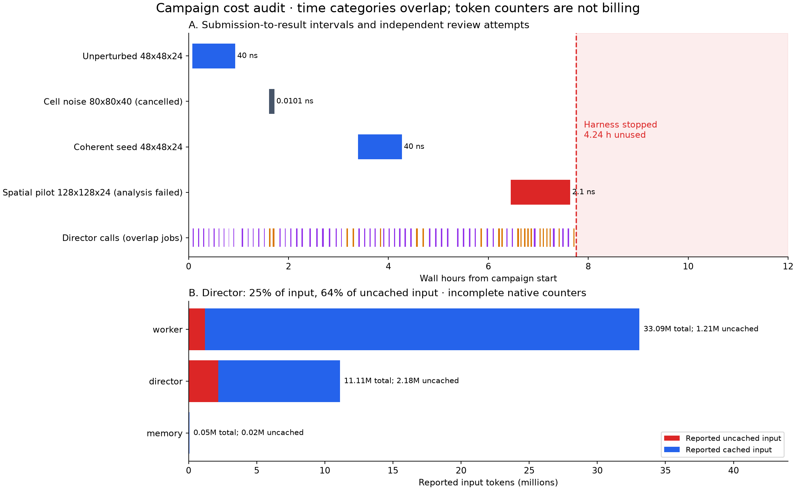

# Adaptive aluminium campaign audit — 2026-10-04

The adaptive campaign produced two complete exploratory 3D FLASH trajectories,
but did not establish whether reconnection supplies at most 10% of the apparent
radiation excess. A reproducible harness exception stopped it **4.24 hours before
its deadline**. The scientific limitations, worker implementation failures and
expensive supervision are separate problems; repairing the exception does not
qualify the physics.

This report audits `013-adaptive-reconnection-attribution-12h`. It uses retained
receipts and native agent streams, and independently rereads seven FLASH
plotfiles and the native radiation/operator budgets on the original numerical
worker. Original receipts, hypothesis, deadline and scientific dispositions are
preserved. The expired campaign has not been resumed or given extra time.

## What actually ran

The campaign began on 2026-10-03 at **16:41:43 UTC+8** and stopped on 2026-10-04 at
**00:27:30 UTC+8**, after **7.763 hours**, rather than its 04:41:43 deadline.
The worker was native Codex GPT-6 Luna/medium. GPT-6.1 Sol/high was the strategy
director, with independent methods/claim review available in separate contexts.
The dedicated numerical host had 16 logical CPUs, about 63 GiB RAM and two P40s;
the FLASH cases used eight CPU MPI ranks. Availability of GPUs does not make
these FLASH builds GPU solvers.

| Recorded numerical attempt | Coverage | Measured source execution | Outcome |
|---|---|---:|---|
| `exp_e7fab29d5adcd0f748594433` | Unperturbed Cartesian 48×48×24, 0–40.035 ns | 51.15 min | Completed exploration |
| `exp_b6003d475cbd122386362ef3` | Cell-noise Cartesian 80×80×40, about 0.010 ns | 6.01 min | Director stopped an unhelpful perturbation implementation |
| `exp_7833ad1b614f541b30b6f476` | Coherent m=1,n=1 density seed, 48×48×24, 0.003395–40.0069 ns | 51.45 min | Completed exploration |
| `exp_222659177b6d8b2fa3b3f1ff` | Unperturbed spatial pilot, 128×128×24, about 2.102 ns | 68.65 min | Cost gate stopped evolution; final Python analysis failed |

The remaining attempts were short initialization, restart, analysis and timing
work. Across all **17 receipts**, nine succeeded, seven failed and one was
cancelled. Nine successful receipts do **not** mean nine complete simulations.
There were no newly approved methods, scientific commitments, claim reviews or
accepted claims. No new RZ or WarpX case ran in this campaign; earlier
commissioning was background, not fresh evidence.

The physical model is the declared late, pre-ablated Al load: wire-equivalent
mass near 76.3 μg, a core/trailing profile and nominal steady 1 MA drive. It uses
the installed Al EOS/opacity and 30 radiation groups spanning 0.1 eV–100 keV,
with the commissioned 10 eV electron/radiation and 1 eV ion initialization.
It is **not** a reproduction of cold-wire ablation and the Zebra experimental
waveform. The coherent seed was a 5% long-wave density modulation, not a measured
wire-array perturbation spectrum.

## What the scientific data support

The [standalone PDF](assets/adaptive-campaign-science-20261004.pdf) and
[sanitized numerical data](assets/adaptive-campaign-audit-20261004.json) retain
the units, intervals and receipt identities behind these plots.

### Complete trajectories now reach a late radiation pulse

Both 48×48×24 trajectories reached 40 ns in roughly 51 minutes using adaptive
CFL 0.2, with `dtmax=1 ns` as an upper cap. Later accepted steps were approximately
39–71 ps, rather than the previously inherited fixed 2 ps cap. The dominant
late pulse occurred near 20.8–21.0 ns. This is useful execution progress beyond
the earlier campaign that reached only about 2 ns.

Spatial resolution still prevents a reliable reconnection measurement. Across
the 18 mm Cartesian domain, the 48-cell grid has 0.375 mm transverse cells: the
nominal 0.2 mm liner is only **0.53 cells** thick. The 128-cell pilot improves that
to 0.140625 mm cells and **1.42 cells** across the liner, still inadequate for
a converged thin-layer measurement. Its cell-centre radial floor is about
0.0994 mm, compared with 0.2652 mm at 48 cells. Reaching the centre-cell floor
does not measure a physically resolved stagnation radius.

### Much of the apparent seeded radiation difference is a window effect

The worker retained a prospective rule: select the connected half-maximum
interval around the largest 30-group power peak within 15–30 ns. That is a
valid conditional observable. It does not make comparisons between different
windows a unique reconnection diagnostic.

| Radiation measurement | Unperturbed | Seeded | Difference |
|---|---:|---:|---:|
| Each case's own FWHM window | 1633.879 J | 1688.408 J | +54.528 J, **3.34%** |
| Both over parent window, 17.481900–26.986457 ns | 1633.879 J | 1645.446 J | +11.567 J, **0.71%** |
| Available history clipped to 0–40 ns | 4175.377 J | 4192.051 J | +16.674 J, **0.40%** |

The seeded own window is 17.380456–27.266580 ns. Its extra window coverage adds
42.961 J, about **78.8% of the own-window difference**. The 0–40 ns seeded record
starts at its 3.395 ps restart; it omits that short pre-seed interval. Native
step-energy integration is overlap-clipped at endpoints, using a constant power
within each step. It is not a new claim-approved diagnostic.

These differences are exploratory sensitivity observations. Density changes can
alter compression, radiation timing and drive coupling without uniquely
identifying direct reconnection energy.

### The kinetic reference needs physical justification

The declared 0–10 ns interval gives the seeded load-tracer sampled reference
**495.069 J at 9.5104 ns**. Its later sampled load kinetic maximum is
**847.978 J at 17.0627 ns**; the box kinetic maximum is about **1022.65 J**.
The early reference is therefore only 58.4% of the later sampled load maximum.

This does not automatically invalidate a prospectively declared conditional
quantity. It does mean the reported excess is not “radiation minus the full
implosion kinetic maximum.” The physical meaning of a pre-stagnation reference
must be established. Parent and seeded snapshot cadences also differ, roughly
2 ns versus 0.5 ns. Native all-step box maxima within 0–10 ns are available,
but cannot silently replace a load-tracer maximum. Whole-box escaped radiation,
load-tracer kinetic energy, ambient material and boundary transport require an
explicit common accounting scope and sampling uncertainty.

With the recorded seeded definition, the own-window apparent excess is
**1193.339 J**, giving a 10% candidate threshold of **119.334 J**. These are
conditional bookkeeping numbers, not an accepted attribution result.

### Magnetic energy is a substantial reservoir; reconnection is unidentified

Independent HDF integration finds about **4055.81 J** of initial magnetic energy
and **527.51 J** at the end of the unperturbed case. Its depletion is about
**3528.30 J**, while available 0–40 ns escaping radiation is **4175.38 J**.
Continuing drive and boundary work matter alongside the initial reservoir.
There is no need to invoke energy creation to exceed a selected kinetic-energy
reference.

The native operator accounting adds an important distinction. Across the full
unperturbed trajectory, the diffusion operator removes **243.12 J** from the
magnetic reservoir and adds **234.87 J** to gas internal energy. Its net change
of approximately −8.25 J is **not** the Ohmic-heating amount. The seeded full
history gives corresponding values **243.90 J** and **235.42 J**. Within its
own FWHM window, internal-energy gain in diffusion is **53.38 J**, versus
62.67 J of magnetic depletion.

The 53.38 J in-window heating is below the 119.33 J threshold, but this does
**not** prove the bound. Heat deposited before the radiation window may radiate
inside it; unresolved numerical magnetic dissipation may occur elsewhere in
the discrete update; and not all resistive heating is reconnection. No validated
topology/flux-change diagnostic or causal radiation attribution was recorded.
The worker's incomplete global energy balance still left approximately **1.50 kJ**
unaccounted for. Missing boundary terms and correction terms cannot be renamed
reconnection energy, nor treated as a quantified uncertainty bound.

Independent projection of the sampled Cartesian fields into cylindrical
components finds that **99.82%** of magnetic energy near the seeded late pulse
(20.525 ns) is azimuthal. None of the seven selected states has negative local
azimuthal field. At 40 ns, both parent and seeded cases have similar radial-field
inventories, about **74 J**, so even non-azimuthal field is not uniquely a seed
effect. These are coordinate-component observations, not field-line connectivity
or reconnection diagnostics; one-signed azimuthal field does not exclude all
possible reconnection. The density Fourier coefficient is likewise a fluid-mode
proxy: it changes from approximately 0.025 at seeding to 0.0196 near the late
power peak and 0.129 at the end. Late asymmetry does not by itself establish
reconnection during the declared photon window.

### A real diagnostic mistake was found and corrected during exploration

The original seeded result treated the stored `r001`…`r030` fields as energy
densities. In this commissioned build they are specific energies, so volume
integration requires **density multiplication**. One near-peak plot would give
about 8.3 MJ without it, instead of **8.47004 J** of stored radiation.

The subsequent recorded audit corrected this, and the independent reread agrees
with the native same-time radiation inventory to about 10⁻⁷ relative precision.
Seven sampled states also had finite, nonnegative values in all 30 groups.
That validates the sampled calculation and unit interpretation, not every
state, energy closure, spatial convergence or the physical model. The original
incorrect result and failed receipts remain in history.

## What went wrong in the process

| Problem | Evidence | Responsibility and response |
|---|---|---|
| Campaign stopped after a formatter error | Three successive `KeyError: 'execution_costs'` failures at 00:27:24–30 | **Harness defect. Fixed.** Lost 4.24 h; no deadline extension granted |
| Spatial pilot evolved, then lost its final JSON | Final path expected `thermodynamic_fields_positive_in_load`, absent from its summary function | **Worker-written program defect.** Preserve partial data; commission the final and early-stop analysis paths |
| Two preceding spatial submissions failed quickly | NumPy `float32`/boolean JSON serialization | **Worker-written program defects.** Skill guidance now covers native scalar conversion and strict atomic summaries |
| Restart work failed | String-typed CSV arithmetic, mismatched checkpoint times, read-only copied checkpoint, overly tight float32 identity checks | **Implementation/qualification failures.** No evidence of a FLASH solver source bug in these receipts |
| Finer 3D grid could not reach the radiation pulse economically | About 22.4 min per ns over the 1–2 ns pilot interval | **Real compute cost.** Cost gate actually stopped this pilot; packaging/analysis then failed |
| Repeated fresh director inspection was costly | 72 calls; 671 captured commands; repeated large artifact reads | **Harness policy plus model behavior.** Add bounded quiet-job deferral and explicit changes since last successful review |
| Post-deadline display obscured the original stop | Effective `budget_exhausted` overlaid recorded `paused_external_error` | **Visibility defect. Fixed.** Keep stop cause, actual elapsed time and unused budget visible |

The 128×128×24 pilot's 1–2 ns measured marginal rate would take roughly another
seven hours to get from 2 ns to a 21 ns pulse, assuming unchanged throughput.
That assumption itself is optimistic near compression. The agent's cost gate
correctly stopped it rather than spending the remaining approximately 4.4 hours
on a full-window refinement. The expensive run was not lost entirely: native
logs, six plots and partial checkpoint state were retained despite its failed
receipt. A failed postprocessor must not be presented as a simulation that
never ran.

The director made **52 durable decisions: 41 continue and 11 replan**. Twenty
calls timed out; one additional I/O failure occurred after a valid verdict was
recorded. There were 51 successful director completion events. The existing
rc1 handling of retained control decisions is relevant to that I/O failure.
The earlier stop-and-replan changes therefore had observable effects: the worker
responded to directives, abandoned the cell-noise approach and obtained complete
adaptive trajectories. They did not solve method qualification or attribution.

## Where the tokens went

These are the latest **native cumulative counters per session**, aggregated by
recorded role. Resumed worker totals are not summed repeatedly.

| Role | Reported input | Cached input | Uncached input | Output |
|---|---:|---:|---:|---:|
| Luna worker | 33,094,765 | 31,888,128 | 1,206,637 | 229,810 |
| Sol director | 11,105,281 | 8,929,536 | 2,175,745 | 83,226 |
| Controller memory | 54,318 | 36,864 | 17,454 | 2,963 |
| Total | **44,254,364** | **40,854,528** | **3,399,836** | **315,999** |

Director input is 25.1% of reported input but **64.0% of reported uncached input**.
Nineteen director streams lack `turn.completed` usage; one timed-out call did
emit terminal usage. Native streams do not provide a complete request-by-request
invoice or vendor/OAuth price. These figures are incomplete counters, not a bill.

The native traces provide more than a future instrumentation proposal:

- The worker had 41 traced turns, 202 completed command events and 12 nonzero
  command exits. Captured command output totalled about **1.20 MB**.
- Director calls captured **671** completed commands and **13.28 MB** of output.
  **107** command occurrences repeated an identical command text. Several
  individual outputs were around **1 MB**; repeated `cat` commands reopened
  `mesh-comparison.json`, then the seeded results and audit documents.
- Total director call elapsed time was **1.766 hours**. Numerical source wall
  time summed to **3.015 hours**. These intervals partly overlap, so adding them
  as disjoint campaign time would be wrong.
- Some analysis programs took 7–20 seconds to execute but waited approximately
  190–506 seconds between submission and source start. Admission, transfer and
  result collection need visibility alongside execution time. This audit does
  not identify every such second as queueing or file transfer.

Captured native stdout bytes are **not** provider input tokens: native tooling
may truncate or transform them. Nevertheless, repeated large-file inspection,
fresh director contexts and an expanding resumed worker history are concrete
sources of avoidable work. The logs cannot precisely apportion every input token
to system instructions, artifact retrieval, repeated history or reasoning.

## Repairs implemented from this audit

1. **Fix bounded-context omission accounting.** Both `progress` and
   `execution_costs` were eligible for eviction but missing from omission counts.
   At 6000 bytes, eviction accessed a nonexistent key and killed the campaign.
   All evictable sections now have counts, including future sections.
2. **Recover from derived context/report defects.** A small recovery context
   rereads primary scientific state, retains real receipt identities, remaining
   time and retrieval instructions, and records a visible diagnostic warning.
   Routine journal/report/navigation failure no longer ends the work loop.
   Corrupted primary state still fails; the final report must persist before
   supervisor completion is published. Successful recovery clears stale warnings.
3. **Expose failures and actual elapsed time.** CLI/shared status and the web
   monitor retain the early stop cause and unused budget after the deadline.
   The monitor shows degraded-context/report warnings, role-level cached and
   uncached input, and submission-to-result latency alongside source execution.
4. **Reduce repeated strategy reviews conservatively.** New studies retain a
   five-minute minimum review cadence, but healthy running jobs with unchanged
   work, fresh telemetry, a feasible previous decision and sufficient margin
   may defer model review to at most 15 minutes. Operational checks continue at
   up to one-minute intervals during deferral. Changed evidence/steering,
   pending replans, transport issues, stale telemetry, forecast risk or a near
   deadline restore the shorter cadence. Existing policies remain unchanged.
5. **Give fresh reviewers an evidence delta.** The director receives changes
   since its last successful review and instructions to retrieve selected fields
   rather than repeatedly dump large files. A failed review does not consume
   this delta. Native read-only inspection remains available; claim acceptance
   and methods review remain separate.
6. **Improve the FLASH skill using observed failures.** Add build-specific
   radiation unit checks, native budget crosschecks, common-window comparisons,
   NumPy JSON conversion, early-stop postprocessing preflight and preservation
   of raw data after analysis failure. This is focused guidance, not a mandated
   research phase schedule or automatic scientific approval.

## Validation and remaining work

Replaying the campaign's retained receipts/notebook locally reproduces the old
`KeyError` at 2048, 4096 and **6000** bytes. The repaired implementation succeeds
at those budgets and 8000/16000 bytes; the 6000-byte replay is 5848 bytes.
The replay is a separate copy, not a rewritten original study.

The repaired source was also copied to a separate audit generation on the
coordinator and tested **against the original remote study**. All five budgets
worked without entering fallback; the 6000-byte context was **5993 bytes**.
Hashes of **91 campaign metadata files** were unchanged before/after inspection.
The new status reader correctly reports an expired budget, the original formatter
error, 7.763 h elapsed and 4.237 h unused at its early stop. This verifies the
actual data path without replacing the original deployment or launching a worker.

Regression tests cover formatter recovery without invented claims, propagation
of primary-state errors, routine report failure without campaign termination,
the completion publication barrier, accurate early-stop display, cache accounting,
director deltas and bounded review deferral. Browser checks exercise desktop and
390 px mobile layouts, both recorded metrics and ordinary execution receipts,
and running versus expired/error states.

The deterministic healthy-job cadence test makes **two model launches rather
than four** over its controlled 15-minute interval. This validates scheduling,
not actual token savings, future research completion rate or review quality.
New plans, stale/unsafe telemetry, transport failure and legacy policy cases are
tested separately. No new paid model comparison or long scientific campaign is
claimed by these repairs.

The full suite finished with **1191 passed, seven skipped** in 350.77 seconds.
The skips cover unavailable optional local solver/EOS runtimes and backend
environments; the remote FLASH data audit above is a separate real-data check.
All **14 DSH/MCP tests** passed. Ruff, JavaScript syntax, strict Sphinx and the
FLASH skill validator passed; all three skill tests also passed after the final
guidance edit. Wheel/sdist builds succeeded, and packaged repair modules and
the FLASH reference matched the source bytes. No private/dependency directories
were included. Build checks did not publish a new release.

For a future investigation, the highest-value scientific work is to establish
an affordable discretization of the thin load and compression, then qualify
the actual energy/window/topology diagnostics. Measure the discrete ideal
boundary fluxes, diffusion magnetic/internal split and numerical corrections;
track heat deposited before the photon window. Justify the kinetic reference and
perturbation family prospectively, and obtain methods review before fresh
evidence. A kinetic patch should be extracted only once a meaningful sheet and
its collisional/thermal/boundary conditions have been identified. More runtime
alone does not turn two unresolved trajectories into a reconnection bound.

A concrete next investigation would start with a recorded, cheap reanalysis of
the existing budgets and raw states: reconcile radiation units/endpoints, list
the missing ideal boundary and correction terms, and quantify the kinetic
reference's sampling sensitivity. Then compare affordable spatial strategies
on realized initial mass/profile and compressed-state coverage; neither another
48-cell seed nor an unqualified global 128-cell full run fixes the thin liner.
Local refinement or a reduced domain needs a qualified boundary/energy mapping.
Preflight the same finalizer with normal completion and an intentional stop.
Once the actual diagnostics and implementation pass methods review, prospectively
test a physically justified perturbation family with fresh full-window evidence.
Extract a WarpX patch only if a meaningful candidate sheet and its conditions
are identified. These are scientific priorities, not mandatory hourly phases.

The [previous adaptive qualification](../testing/research-director-adaptive-20261003.md)
and [execution repair report](../testing/zpinch-repair-qualification-20261003.md)
remain separate historical records. To reproduce the public plots, run
`uv run --with matplotlib python scripts/plot_adaptive_campaign_audit.py` from
the repository root.
