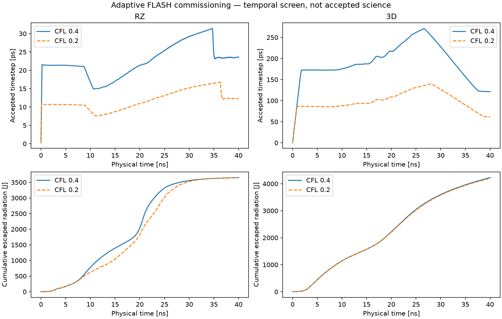

# Research director and adaptive FLASH qualification — 2026-10-03

This follows the [execution repair audit](zpinch-repair-qualification-20261003.md).
It adds execution strategy control to minimal studies and qualifies an affordable
adaptive path before a fresh Al radiation-excess campaign. These are unreleased
source/private deployment changes on stable 0.5.3; no new public package is implied.

## Control changes

The old supervisor skipped progress review while waiting for long jobs. A progress
review could express concern but had no structured experiment-stop action. New
minimal studies enable a director on the independent reviewer route by default.
Old launches preserve their saved policy. Structured/frontier supervision is unchanged.

The director evaluates budget feasibility separately from scientific usefulness.
It receives the original hypothesis/protocol, advisory operator steering, remaining
wall time, recorded costs, active operational timing and recent plans. It runs at
roughly five-minute intervals during waits; native worker turns also checkpoint
within five minutes. Sustained planning without any recorded experiments can also
receive a strategy review. An expensive or invalid configuration can receive a concrete
replan with named experiment stops. The host executes those stops, retains available
partial data and wakes the worker. It cannot change the claim, deadline or evidence rules.

The worker records a fresh next-test plan and acknowledges the directive, or records
a reasoned challenge. New numerical submissions require that response; reading,
idempotent replay and short exploratory diagnostics remain available. A response
is not approval. Methods and final scientific claims still receive independent review.
The records live under `director/` and `director-acks/`. The GUI exposes the launch
switch, reviewer/director model and effort, decisions, control confirmations and responses.

`lab.cancel` targets receipts in the current study. Optional JSON/FLASH live monitors
propagate through local execution and SSH workers. Observations and linear forecasts
are operational, not claim evidence. Missing/stale timing is explicit. Absent monitors
preserve legacy worker request serialization and replay identity. Codex native UUID
usage receives explicit role labels; old unlabelled records remain `other` rather than
inventing their provenance. Provider counters/billing limitations remain unchanged.

## Adaptive policy and hypothesis scope

FLASH guidance and worker/director prompts prefer qualified adaptive CFL stepping.
`dtmax` is an upper bound, not a forced update. Radiation, transport and hydrodynamic
accuracy/stability remain necessary, including through stagnation. A startup comparison
cannot authorize a large production step. The strategy is to obtain an affordable
complete exploratory trajectory, then refine where the conclusion depends on accuracy.
No fixed hourly allocation or solver sequence is imposed.

The new hypothesis separates the Ivanov-scale pre-ablated Al load from its numerical
implementation. Mesh, timestep, ranks, output cadence and qualified restarts can change.
Physical drive/closure/initial-state/perturbation variants require explicit scope.
The positive radiation-excess definition needs prospective radiation and run-in
kinetic-reference intervals for the same realization/control volume. An absent
measurement, nonpositive denominator or quiet RZ case cannot prove the 10% candidate
bound. Local patches retain their coverage limitations. The prior investigation is preserved.

## Local and live-model verification

Targeted local batches cover control validation, waiting-loop wakeup, real native
monitoring and selective cancellation, partial retention, legacy resume/replay,
methods/claims, worker execution, provider recovery/accounting and GUI integration.
Desktop 1440 px and mobile 390 px browser checks show telemetry, director reasoning,
stop confirmation/acknowledgement and artifact links without JavaScript errors or
horizontal overflow. A browser launch test verifies that model, effort and the director
switch survive into the native launch contract.

There are **345 unique passing local tests** across these batches, plus **7 optional
runtime skips** (local PRoot and optional numerical installations). Ruff, JavaScript
syntax and diff checks pass. One HTTP test initially used the inherited proxy for a
loopback URL; it passed with loopback `NO_PROXY`, without changing user routing.

A separate real Codex OAuth fixture used GPT-6 Luna/medium and GPT-6.1 Sol/high.
A deliberately unfinishable job wrote 0.002 ns and slept. Sol declared budget
infeasibility, requested its named stop and preserved scientific uncertainty. The
host cancelled it with partial JSON retained; Luna recorded and acknowledged a new
plan. The campaign hypothesis and original deadline remained fixed. The fixture
finished in 77.24 s and did not establish a scientific result.

| Role | Native input tokens | Cached input | Output tokens |
|---|---:|---:|---:|
| Sol director | 16,838 | 12,288 | 440 |
| Luna worker | 110,008 | 91,904 | 984 |

These are native CLI counters for this fixture, including its internal tool turns;
they are not provider invoices or a forecast of the 12-hour research cost.

## Full-window numerical qualification

The operator submits matched RZ 128×64 and Cartesian 3D 32×32×16 cases through the
exact native SSH experiment launcher, reserving four/eight MPI ranks respectively.
The Al EOS/30-group table, nominal drive, initialization and analysis definitions
are fixed between each CFL 0.4/0.2 pair. Adaptive startup is 0.25 ps, the upper bound
is 1 ns, and the requested trajectory is 0–40 ns. Output cadence is 2 ns. CPU timing
is recorded with other commissioned jobs sharing the host; it is not an isolated
scaling benchmark.

The first 3D CFL 0.4 trajectory reaches 40.035 ns in **952.97 s** of native solver
wall time. Finite states, positivity, reported solver convergence, divergence and
radiation boundary/operator agreement pass. Its ~3.06% total mass inventory change
includes open boundary transport; it is not asserted to be a closed mass budget.
The coarse mesh and incomplete electromagnetic balance preclude a reconnection claim.

The matched comparison uses a prospective 5% scalar energy/inventory screen and
1 ns radiation-peak timing screen. It records all group-field readback, accepted
steps and cumulative radiation histories. Terminal flux is clipped to the common
40 ns window with an explicit within-step approximation; terminal inventories use
snapshot interpolation. The staged kinetic maximum is an engineering metric,
not a silently chosen research run-in kinetic reference.

All four cases complete. The componentwise temporal screen **does not pass**;
the original failed comparison is retained. Execution readiness is recorded separately,
with `scientific_claim_approved=false`. The next research phase must qualify accuracy
for its chosen observables and window before scientific evidence approval.

| Geometry / CFL | Native wall | Updates | Escaped radiation at 40 ns |
|---|---:|---:|---:|
| RZ 128×64 / 0.4 | 1,950.48 s | 1,873 | 3,651.41 J |
| RZ 128×64 / 0.2 | 3,102.99 s | 3,569 | 3,649.58 J |
| 3D 32×32×16 / 0.4 | 952.97 s | 274 | 4,227.99 J |
| 3D 32×32×16 / 0.2 | 1,206.51 s | 468 | 4,199.02 J |

Radiation-yield differences are 0.0502% RZ and 0.6899% 3D. However, RZ peak
staged kinetic inventory differs 8.42%, and its late kinetic/magnetic inventories
37.6%/20.7%; 3D late magnetic inventory differs 11.46%. Residual stored radiation
also fails the componentwise screen. Small residual components need an appropriate
absolute error budget for an actual attribution claim, rather than being ignored
or automatically assigned the same relative tolerance as total yield. No post-hoc
change makes this failed screen a pass.

All **2,880 group arrays across 96 native dumps** are finite and nonnegative.
The unresolved coarse 3D largest broadband-power peak is near 4.4 ns, whereas
RZ peaks near 20.5 ns. This requires spatial/initialization/control-volume assessment;
it is not asserted to reproduce the RZ stagnation trajectory. Complete coarse
trajectories are feasibility data, not a physical model validation.

The research launch carries the failed screen, separate execution-readiness record,
CFL 0.2 exploratory starting advice and requirements for tighter accuracy/physical
qualification. It also warns that enlarging the single-tar commissioning wrapper
can exceed the 512 MiB per-file limit; larger cases need deliberate sharding/cadence.
No original commissioning bytes or previous investigation results are replaced.

## Limits

A temporal engineering screen is not spatial convergence, discrete global energy
closure, experimental reproduction or direct photon attribution to reconnection.
Coarse full trajectories help choose useful research; a 5% global numerical tolerance
cannot itself prove a 10% causal contribution bound. RZ does not represent the required
non-axisymmetric topology. WarpX kinetic patches still need plasma-state, collisionality,
scale and cooling qualification and do not independently predict escaped radiation.
The director improves timely decisions but cannot guarantee good scientific judgment.

## Fresh autonomous deployment

A separate live test on the refreshed SSH worker confirmed operational telemetry,
named cancellation and retention of partial JSON; stop confirmation was true.
An initial fixture reader assumed missing telemetry was always a dictionary;
it was corrected to handle the explicit null/unknown value. The failed fixture
and its cancelled receipt were preserved; the subsequent v3 test passed.

Study `013-adaptive-reconnection-attribution-12h` is deployed on DESKTOP-NVML34D
with the P40 numerical worker, using **GPT-6 Luna / medium** and **GPT-6.1 Sol / high**
for the director and independent scientific review. The 12-hour wall deadline is
**2026-10-04 04:41:43 Asia/Shanghai**. Minimal mode, native tools, adaptive numerical
freedom and the original counterexample/repair completion rule remain in force.
The director is enabled with a five-minute interval and two-minute call allowance.
The launch retains the accuracy failures and explicitly makes tighter numerical
and physical validation required work for the research phase. No fixed phase
schedule, compulsory solver sequence or scientific conclusion is assigned.

Previous studies and immutable reference installations remain available. Source
changes are privately deployed on 0.5.3 and committed for review; they are not a new
public release. Launch and supervision survive the browser/SSH viewer closing.

The live launch exposed a GUI discovery gap for operator-added studies after server startup. Campaign polling now registers new workspace study records without a restart; a regression check covers that admission. The first real director review returned continue / budget feasible / science limited, while a FLASH refinement was running with a40ns live monitor.
