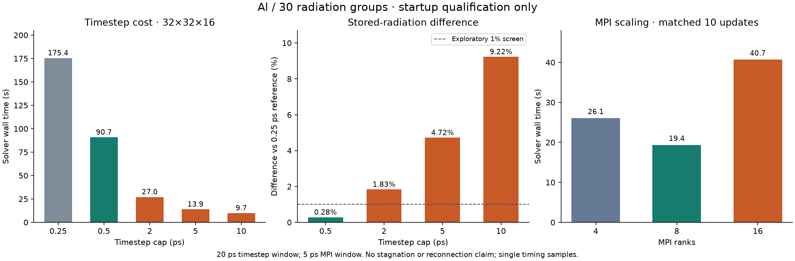

# Z-pinch execution and timestep repair qualification

This is an engineering follow-up to the October 2–3, 2026 Luna/Sol aluminium
reconnection-attribution campaign. It is not a new scientific verdict. The
12-hour campaign exhausted its deadline without an approved method or claim;
the proposed bound on direct reconnection energy remains unresolved.

## What the run actually exposed

| Observation | Attribution and repair |
|---|---|
| The 2 ns 3D case took 4,009 timesteps, 120,270 radiation-group solves and 13,545.7 s of solver wall time. Hypre calls took 8,018.4 s, including 6,061.1 s in GMRES setup; these are nested timers, not additive costs. | The radiation solve is expensive. The 0.5 ps cap was not justified by a recorded temporal-convergence study. Timing and accuracy need measurement before choosing larger steps or buying hardware. |
| A 16-rank job reserved 16 CPUs but Open MPI reported insufficient slots. | Harness wiring: map the reservation into explicit localhost slots. The new helper rejects excess ranks and does not oversubscribe. |
| A 16-rank collective still hung under PRoot after the slot repair. | Reproduced software incompatibility. TCP, disabled CMA and disabled seccomp variants did not repair it. The same binary completed natively in 0.316 s. The internal PRoot/MPI cause is not established. |
| Method registration received prose in `blockers`. | Agent API misuse, compounded by ambiguous naming and errors. Valid registration worked. Add field-specific validation, explicit `blocker_experiments` IDs and descriptive `limitations`. |
| Evidence-stage postprocessing was blocked while method review was pending. | The approval rule was intentional, but the guide was misleading. `lab.analyze` records frozen exploratory diagnostics; using them in a claim still requires a qualified method and fresh evidence. |
| Reviews corrected diagnostics but did not secure relevant physical-window or resolution coverage. | A scientific strategy problem as well as an information-flow problem. Show measured cost and receipt-backed advisory targets to worker, reviewer and operator; ask reviewers to assess scientific coverage. This does not impose a phase schedule or guarantee better research decisions. |
| A runtime was reported changed after successful native FLASH startup. | An additional harness defect found during this qualification: dependency identity depended on a directory inode. The host uses OverlayFS with `xino=off`. The source inode changed from 589718 to 599110 while runtime identity remained unchanged; all 6,338 recorded source files matched their hashes. Use a verified source manifest where inodes are unstable. |

[Linux's OverlayFS documentation](https://docs.kernel.org/filesystems/overlayfs.html)
explains the nonpersistent inode behavior possible with `xino` disabled. That
supports the filesystem explanation; it does not explain the separate PRoot MPI
hang.

## Repairs implemented

- A mounted, dependency-free single-node Open MPI helper uses the reserved CPU count.
  Compiler symlinks resolve through read-only `/etc/alternatives`.
- Explicit `process-cooperative` executes trusted code under an unprivileged
  account, retaining frozen-input checks, deadlines, descendant cleanup, sampled
  RSS monitoring and receipts. CLI, TUI and browser expose it. Automatic selection
  remains Bubblewrap then PRoot. Native execution has host filesystem/network
  access and is not an OS security sandbox.
- Alternative profiles for one SSH address/port cannot double-count host capacity.
  Original worker roots, generations and job records remain available.
- Optional `.simjecture-source-manifest.json` verifies the content of every declared
  source file. Byte changes, bad hashes and path escapes fail. It covers listed
  files, not unlisted additions. Legacy dependency identities remain unchanged
  when no manifest is provided; introducing a manifest requires new qualification.
- Method reference errors are actionable; legacy receipt-ID arguments retain
  identity compatibility.
- Frozen exploratory analysis is available without weakening evidence-stage gates.
- Advisory `lab.progress` observations verify actual JSON output identity and values.
  Target meaning, units, baseline and series remain researcher declarations.
  Conditional forecasts separate cases and become invalid if their artifact changes.
  They cannot close claims or alter deadlines.
- Worker briefs always include recent measured execution costs. Review prompts
  consider physical coverage and feasible discriminators. The run monitor displays
  registered observations under **Scientific coverage & cost**, with artifact links.
- Read-only Codex reviewer events are accepted, worker/reviewer reasoning efforts
  remain separate, and cancellation preserves partial artifacts during a bounded
  harvest grace period.

## Real remote qualification

All numerical qualification uses the exact SSH experiment dispatcher, frozen
programs and recorded outputs. No additional Luna/Sol provider requests were made.
Private FLASH code, licensed tables, credentials and raw arrays are not shipped in
this repository.

The ten-step matched four-rank probe measured **25.73 s native versus 37.19 s
PRoot**, a 1.445 ratio. Seven checkpoint fields matched byte-for-byte. This is a
short startup measurement, not a campaign-wide speedup.

Studies 006 and 007 preserve compiler and PRoot failures. Study 008 records successful
4-, 8- and 16-rank collectives and a **96×96×64, 16-rank, 30-group FLASH startup**:
181.98 s inside the solver and 184.78 s measured execution, reaching 0.01210938 ns.
Its HDF5 fields were finite, density positive and all 30 groups readable/nonnegative.
This verifies the intended launcher and grid can execute; it does not qualify a
long stagnation run. Later sweep submissions in that study hit the inode issue.

A new worker generation validates **6,338 source files / 47,676,871 bytes** against
the existing source record; the first verification took 4.15 s. Study 009 measures
timestep sensitivity on the same 32×32×16 grid over 20 ps. It compares scalar
energies and relative field L2 differences with a 0.25 ps reference. The prospective
1% startup screen is an engineering tolerance, not a scientific acceptance threshold.
Study 010 measures matched ten-step FLASH startup at 4, 8 and 16 ranks after the
sweep, so the timing jobs do not overlap.

| Timestep cap | Solver wall time | Stored-radiation difference vs 0.25 ps | Radiation field L2 difference |
|---|---:|---:|---:|
| 0.25 ps (reference) | 175.41 s | — | — |
| 0.5 ps | 90.74 s | 0.280% | 0.281% |
| 2.0 ps | 26.96 s | 1.830% | 1.833% |
| 5.0 ps | 13.86 s | 4.716% | 4.718% |
| 10.0 ps | 9.74 s | 9.224% | 9.256% |

The 0.5 ps case is within the exploratory 1% scalar/vector screen; 2, 5 and
10 ps are outside it. These quantities describe **stored radiation**, not escaped
x-ray yield or reconnection attribution. The 0.25 ps reference is not an exact
solution or a completed convergence study. No production timestep was changed.

The original component-relative field comparison gave large ratios for almost
zero axial components. A fresh frozen v2 analysis instead normalizes velocity and
magnetic components by the corresponding total reference vector norm. Both
receipts and definitions are retained; v2 was introduced after inspecting the
data and is exploratory. This avoids treating tiny axial fields as order-one
changes to the total magnetic field.

| MPI ranks | Matched ten-step solver wall time | Speedup vs 4 |
|---|---:|---:|
| 4 | 26.07 s | 1.000× |
| 8 | 19.37 s | 1.346× |
| 16 | 40.71 s | 0.640× |

Every case reached 0.005 ns with the same recorded step index. Relative scalar
differences were below 1e-9. Eight ranks were fastest for this mesh; sixteen were
slower than four. This is one serial timing sweep on a shared host, without
confidence intervals. It does not determine the best rank count for the larger
96×96×64 mesh or stagnation.

The initial postprocessing fixture incorrectly declared an input directory. It
was corrected to list the five existing array files explicitly; the same study
budget and numerical receipts were retained. This was an operator-fixture API
error, not a solver failure.

## Regression checks and release boundary

The targeted local batches passed: execution/API/cancellation/MPI (56),
service/reviewer/journal/browser/onboarding (151), study/CLI/deployment/TUI/navigation
(154), and core capability/claim/content-manifest checks (119): **480 passed** in those batches; two additional GUI cases and five additional identity/environment cases also passed (**487 unique cases** overall).
Seven unique tests skipped because local PRoot or optional solver runtimes were
absent. Real remote FLASH and MPI checks cover the relevant solver launch path.
Subsequent overlapping 58-, 100- and 19-test regression batches also passed; those are not added to the unique count. Ruff and diff
whitespace checks passed.

Desktop (1440 px) and mobile (390 px) browser checks exercised target values,
conditional cost warnings and artifact links. The live remote monitor rendered the
real qualification observations without browser errors.

These changes are unreleased source/deployment repairs on top of 0.5.3. No new
public package or long autonomous research campaign is launched by this qualification.

## What remains scientifically necessary

A startup timestep screen cannot establish accuracy during compression or the
radiation peak. Before using a larger cap as evidence, repeat the comparison over
a declared radiation-active/restart window with appropriate conservation and
resolution checks. Full 3D radiation MHD remains costly even after fixing execution.

The study still needs a qualified, resolved mechanism discriminator, consistent
energy/control-volume accounting, a physical reconnection attribution, and an
independent verdict. RZ, 3D patches and kinetic patches have different coverage;
a successful local WarpX build is not proof that its current sheet represents the
Al pinch. Better execution and visibility help the agents choose feasible work;
they do not replace the scientific reasoning or establish the 10% bound.

## Remaining stop-and-replan gap found in the review trace

Follow-up inspection of the actual Sol verdicts shows that cost information was
not completely missing. Oversight 00004 estimated roughly four hours for a 2 ns
pair even with ideal four-rank scaling and noted its endpoint was far earlier than
the radiation peak. It still recommended executing the pair. Oversight 00008
explicitly called extension to the reference peak impractical at the measured
roughly 3.75-hour cost per 2 ns, then recommended repairing postprocessing. These
are recorded planning choices, not evidence that Sol had no relevant information.

The harness also inhibits timely reconsideration. In `ResearchSupervisor.run`,
the branch waiting for queued/running experiments sleeps and continues before
`run_oversight`. Thus periodic progress oversight is skipped during those waits.
`OversightVerdict` permits `continue` or `revise`; a progress verdict is retained
as worker feedback, not executed as an experiment-stop or replan instruction.
The generated agent client exposes no receipt-aware experiment cancellation call.
Native shell access is not a substitute for an auditable control-plane operation.

The execution, source-identity and cost-visibility repairs above do **not** repair
this strategic-control gap. A follow-up should keep cheap operational monitoring
active during numerical jobs, trigger bounded strategy review when feasibility
changes, and allow a research director to stop named experiments with preserved
partial artifacts and an explicit reason. A replan should be acknowledged by the
worker with an action or a reasoned challenge. Scientific correctness and budget
feasibility should be distinct judgments, visible with executed control actions
in the GUI. Ordinary waiting should still avoid unnecessary provider turns.

Stopping an experiment must not terminate an unresolved investigation or weaken
its hypothesis. Adaptive timestepping is a candidate to test with representative
accuracy checks; the startup 58 ps MHD limit is neither a fixed-step prescription
nor proof of accurate radiation evolution. No strategic-control implementation
or new autonomous campaign is claimed by this follow-up note.
