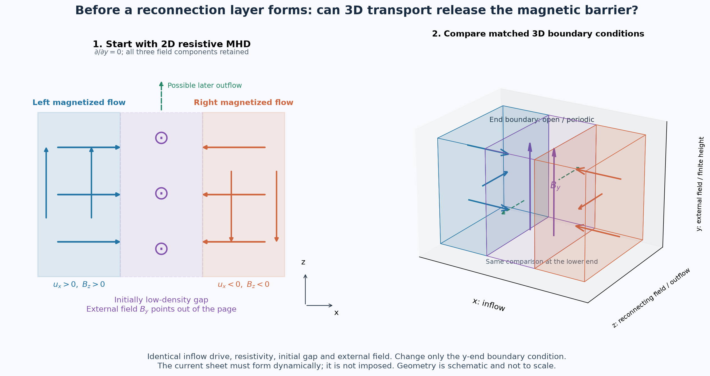

# Candidate study: what releases the magnetic barrier before reconnection?

Status: literature-grounded proposal, not a result or a qualified experiment.
Prepared 2026-09-23 for the dedicated Simjecture machine.

## Motivation and sources

Varnish et al. report delayed current-sheet formation with a strong external
field in colliding wire-array flows. They interpret it as compressed magnetic
flux holding the flows apart. Their 3D MHD comparisons are qualitative; both
inflow calibration and the treatment of external flux boundaries deserve care.
This makes barrier release, rather than reconnection in an already imposed
current sheet, an experimentally motivated target.

- [Varnish et al., 2026, arXiv:2605.15427](https://arxiv.org/abs/2605.15427)
- [Datta et al., radiatively cooled experiments, arXiv:2401.17923](https://arxiv.org/abs/2401.17923)
  establishes a separate radiative regime; it is not justification for neglecting cooling there.
- [WarpX PR #7061](https://github.com/BLAST-WarpX/warpx/pull/7061), pinned for deployment
  at `3cb50a4b71b304f7bb64af4040a7b0b911e0ffb0`.

The proposed comparison below is our study design, not a result asserted by
these sources. Novelty is not established by this initial literature review.

## Initial hypothesis and decisive comparison

Candidate hypothesis: **for a finite-height, colliding magnetized-flow system
with appreciable external magnetic back-pressure, allowing transport through
the ends reduces the reconnection-onset delay by at least 25% relative to an
otherwise matched periodic-height system.** The mechanism to test is whether
3D expansion and magnetic-flux redistribution reduce the pressure barrier
before resistive penetration alone would do so. **This causal interpretation
is a separate requirement for claiming an explained result, not an assumption.**

The first inexpensive study is 2D resistive MHD. Establish the zero-field
reference and a reproducible delayed-onset state; measure its flux and momentum
budgets and sensitivity to resistivity. Then test the actual dimensionality
hypothesis using matched 3D periodic and open-end domains. A 2D result cannot
support the 3D claim.

This targets ablation-flow reconnection first. MRT is a subsequent question:
interface corrugation could make escape channels, but introducing acceleration,
MRT growth, radiation, and uncertain ablation simultaneously would confound
this first causal comparison.

## Controlled physical representation

Use two opposing finite plasma inflows, anti-parallel reconnecting fields,
and an initially magnetized low-density gap. Model inflows as imposed plasma
sources, not a first-principles simulation of solid-wire ablation.

Use Cartesian coordinates: inflow x, reconnecting field/outflow z, external
field and third dimension y. The 2D calculation retains all vector components
but has no y dependence. Clearly distinguish initially excluded external flux
from a guide field already advected with the inflowing plasma.

Define before evidence:

- upstream velocity U0, mass density rho0, reconnecting field B0, gap scale L0;
- magnetic diffusivity D = eta_Ohm/mu0 and Rm = U0 L0/D;
- external pressure ratio Pi = B_ext^2/(2 mu0 rho0 U0^2);
- finite height H/L0, inflow ramp, total drive duration, beta and Mach numbers;
- gap density floor and smooth transition thickness.

An exploratory, dimensionless commissioning matrix is Pi = 0, 0.1, 0.5, 1;
Rm = 1, 3, 10, 30; H/L0 = 1, 2, 4 for subsequent 3D comparisons. These are
chosen design points, not measured experimental parameters. The proposed first
3D pair is Pi=0.5, Rm=10, H/L0=2, conditional on a resolved 2D delayed regime.
If commissioning shows it is unresolvable or physically inconsistent, revise
the prospective study specification before freezing the evidence program.

Ideal-gas resistive MHD with prescribed diffusivity is a mechanism model.
Map it to a laboratory material only after checking collision frequencies,
ionization, radiative losses, transport coefficients, and Hall scales. Do not
label a prescribed-density vacuum floor as experimentally measured plasma.

## Observables and falsification

Measure independently: inflow arrival, pressure-barrier formation, current-sheet
formation, magnetic-connectivity change, and sustained reconnection. A dense
sheet, enhanced J^2, or magnetic-energy loss alone does not demonstrate
reconnection.

In 2D, reconstruct flux from magnetic fields with the documented coordinate
and staggering convention; use bounding separatrices, not arbitrary global
O/X-point pairing. A candidate onset definition is 5% of a fixed reference
reconnecting flux transferred and sustained for 0.1 L0/U0. Freeze its precise
normalization and sampling before evidence; challenge the threshold afterwards
without changing the primary outcome.

In 3D, a scalar 2D flux function is not sufficient. Validate field-line
connectivity between specified source patches and track its transferred flux,
with a nonideal-voltage diagnostic as a cross-check. Test divergence errors,
field-line interpolation tolerance, seed density, and boundary classification.
An open y boundary must preserve normal-field continuity into an exterior
reservoir; setting By to zero at the end would manufacture barrier release.

For each boundary condition compute delay relative to its own zero-external-
field control. Compare that excess delay between open and periodic cases,
so a generic end-loss acceleration is not mistaken for magnetic-barrier release.
Report absolute onset times too. If the reference excess delay is not resolved
above numerical uncertainty, the relative 25% hypothesis is untestable there.

Close the magnetic flux, mass, momentum, and energy budgets through the ends
and through the in-plane boundaries. Flow parallel to By can remove mass but
does not by itself advect By out through a y-normal end. Resolve transverse
transport and magnetic-stress changes instead of attributing guide-flux loss
to parallel outflow. The explained result has two requirements: the
onset reduction and a quantitatively verified barrier-release mechanism. A timing difference
without the transport budget supports neither the full claim nor a mechanism.

A qualified open-end case with <25% reduction falsifies the bounded timing
prediction; a difference driven by changed injection or numerical diffusion
invalidates the comparison. No onset before the integration horizon is a
censored result, not proof that reconnection is impossible.

## Commissioning and cost gates

1. Analytic diffusion decay, ideal advection, and pressure-balance controls.
2. Source/boundary checks and a no-external-field reconnection control.
3. Spatial and temporal refinements, domain-size and gap-floor sweeps. Aim for
   <=5% onset-time changes; tighter if needed to resolve the primary contrast.
4. 3D periodic solution approaches the 2D reference when y perturbations vanish.
5. Validate open-end flux accounting without reflections reaching the active
   layer; vary height and extend the domain. Open boundaries do not by themselves
   prove an experimental vacuum boundary has been reproduced.
6. Run short timing pilots. Start with modest 2D meshes, then a thin 3D domain;
   choose final grids from measured convergence, not a fixed cell-count promise.

Use FLASH first for the collisional fluid mechanism. The installed driven-sheet
binary is a deployment baseline, **not an implementation of this new problem**;
its initial/boundary conditions and diagnostics must be extended and commissioned
in the private FLASH tree. Preserve FLASH source privately.

Use WarpX hybrid-PIC only where kinetic ions are a justified next discriminator
and the fluid-electron closure remains valid. PR #7061 treats magnetic diffusion
implicitly; it does not implicitly solve all Hall/electron dynamics and does
not remove model-validity requirements. Compare small-step explicit and implicit
diffusion at fixed physics before larger-step use; vary timestep and solver
residual tolerances. Demonstrate the exact-curl-curl preconditioner in a native
regression before claiming that this deployment enables it.

The machine's two Pascal P40s permit separate GPU cases. Double-precision
performance and MPI/PRoot overhead must be measured; neither "GPU" nor more MPI
ranks guarantees faster elapsed time. Do not schedule two cases onto GPU0 by
accident. Multi-GPU coupled runs require a separate two-rank test.

## Simjecture contract

Keep the frozen hypothesis, source, runtime hashes, exact input cases, output
contracts, counterexamples, and prospective minimal repairs. Retain inconclusive
and censored outcomes. Transient provider retries resume the existing study and
jobs; they do not create substitute experimental evidence. End only at the
scientific completion gate, an operator action, a hard external error requiring
attention, or the absolute wall deadline. Record the explicitly selected
execution backend; the cooperative container fallback is not kernel isolation.

## Geometry

[Vector SVG](geometry.svg) · [PDF](geometry.pdf) · [Plot source](plot_geometry.py)
