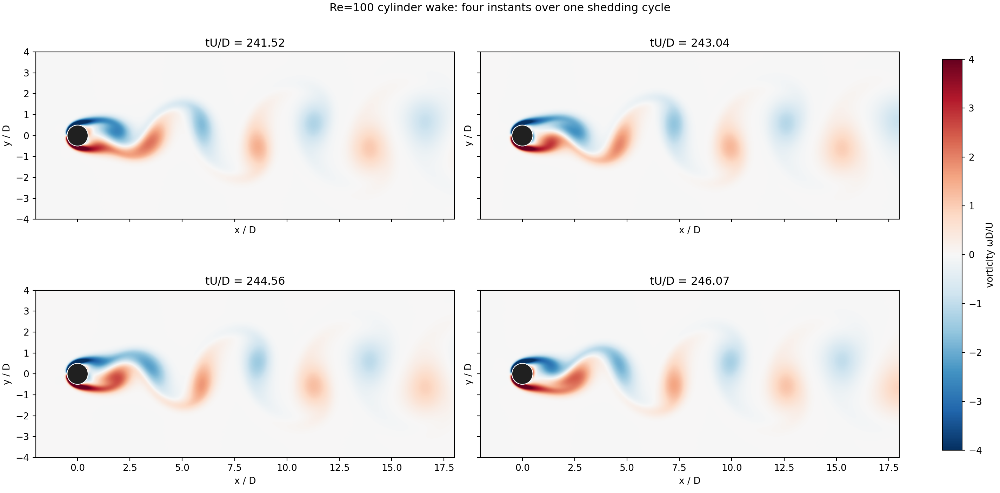

# 圆柱绕流 Warp-LBM 求解器

基于 NVIDIA Warp 的二维 D2Q9 MRT 格子玻尔兹曼程序，用光滑颗粒悬浮模型（PSM）表示圆柱边界。仓库提供正演求解、Re=100 验证、计算域扫描、力系数诊断，以及从稳定周期中导出涡量场图片的脚本。

本仓库整理的是**可复现的代码与精选图表**。计算产生的完整 `forces.npz`、`mean.npz` 和快照文件不放进 Git 仓库；运行脚本后会保存在指定结果目录。

若准备首次上传 GitHub，请解压发布包，将最外层的 `cylinder-warp-lbm` 目录作为仓库根目录。在该目录执行 `git init`、`git add .`、`git commit -m "Initial release"`，再关联你创建的空仓库并推送。压缩包本身不含 Git 历史，也没有自动推送到远程仓库。

## 四个时刻的涡量场



图中是同一涡脱落周期内近似等间隔的四个时刻，红色为正涡量，蓝色为负涡量。设置为 Re=100、`nd=32`、`H=L=80D`、圆柱距入口 `40D`，横向/出口吸收层宽度分别为 `8D/6D`。横轴显示圆柱中心前 `2D` 至下游 `18D`，纵轴为中心线上下各 `4D`；涡量采用 `ωD/U` 无量纲化。四张[单独图片和采样时间](docs/figures/vorticity/)也已提供。

## 程序文件

| 文件 | 功能 | 常用输入与输出 |
|---|---|---|
| `cylinder_warp_lbm_solver.py` | 核心求解器。含 D2Q9 MRT 碰撞、PSM 圆柱、入口与侧壁边界、可选吸收层，以及 `table`、`run`、`sweep` 命令。 | `run` 输出力系数 CSV、末态图；加 `--save-field` 输出末态场。 |
| `validate_re100.py` | 运行命名的 Re=100 算例，按最后 10 个完整涡脱落周期计算 St、Cd、Cl′，并保存力历史及平均尾迹。 | 每例输出 `summary.json`、`forces.npz`、`mean.npz`；启用 `snaps` 的算例额外输出 `snaps.npz`。 |
| `domain_sweep.py` | 调用验证程序，分别改变域高、入口/出口距离、网格和吸收层，核验阻塞比及网格敏感性。 | 按算例名运行；结果写入 `--out` 指定的目录。 |
| `capture_vorticity.py` | 从稳定的 Re=100 长域计算中采集一个周期内的四幅涡量场，生成单图、拼图及采样元数据。 | 输出 `vorticity_phase_01…04.png`、`vorticity_four_instants.png`、`capture.json`。 |
| `plot_re100.py` | 为 `validate_re100.py` 生成的传统 `base` 系列算例绘制力历史、相位场、平均尾迹和对照表。 | 读取含 `base` 算例的结果目录，在其中写入 `fig*.png` 与 `comparison.md`。 |
| `diag.py` | 快速查看任意一个或多个验证算例的 Cl 历史，以及末 25 个对流时间内的 Cl/Cd 波形。 | 读取 `forces.npz`，输出诊断 PNG。 |

其余内容：[`docs/re100_validation.md`](docs/re100_validation.md) 是长域与文献核验报告；[`docs/grid_convergence.md`](docs/grid_convergence.md) 是网格收敛报告；`data/` 中保存汇总 CSV 和逐例统计；`docs/figures/` 提供阻塞比、网格及涡量场图片。

## 环境

已在 Windows、Python 3.10.15、Warp 1.14.0、NumPy 2.0.1、Matplotlib 3.10.9 和 NVIDIA RTX 4080 SUPER 上运行。验证和涡量快照需要 CUDA GPU；`table` 命令可用于先检查参数。安装依赖：

```bash
python -m venv .venv
# Windows: .venv\Scripts\activate
# Linux/macOS: source .venv/bin/activate
python -m pip install -r requirements.txt
```

Warp 编译缓存默认写入用户缓存目录；需要改位置时设置 `WARP_CACHE_PATH` 环境变量。首次运行 CUDA 核函数需要编译，耗时会高于后续运行。

## 快速开始

在仓库根目录执行：

```bash
# 查看内置 Reynolds 数配置
python cylinder_warp_lbm_solver.py table

# 运行已验证的 H=80D 方形域（较长计算；结果目录可自行命名）
python domain_sweep.py H80_L80_Xu40 --out results/domain

# 查看上一个算例的力历史
python diag.py H80_L80_Xu40 --results results/domain --out results/force_history.png

# 重新生成四个时刻的涡量图，保留仓库附带的原图
python capture_vorticity.py --out results/vorticity_rerun
```

`domain_sweep.py` 必须显式给出一个或多个算例名；例如 `H120_L120_Xu60 H160_L120_Xu60` 是固定入口/出口各 `60D`、比较两种低阻塞比的算例。每例已完成时会跳过；传入新的 `--out` 目录即可重新运行。

网格收敛核验固定 `H=L=80D`、入口/出口各 `40D`、运行到 `tU/D=300`，依次运行：

```bash
python domain_sweep.py H80_L80_Xu40_nd32_t300 H80_L80_Xu40_nd48 H80_L80_Xu40_nd64 H80_L80_Xu40_nd80 --out results/grid
```

数值、相邻变化率与平均尾迹剖面见[网格收敛报告](docs/grid_convergence.md)。

单次求解的示例：

```bash
python cylinder_warp_lbm_solver.py run --re 100 --nd 32 --u 0.06 \
  --H 80 --L 80 --xc 40 --tconv 250 \
  --side-sponge-len 8 --out-eq-sponge-len 6 \
  --device cuda --out results/single
```

Windows PowerShell 中将反斜杠续行改成一行输入。`H` 为域的**全高**，`L` 为总流向长度，`xc` 是圆柱中心到入口的距离，出口距离为 `L−xc`，阻塞比为 `D/H=1/H`。

若需复现早期短域算例及传统相位图：

```bash
python validate_re100.py --cases base,nd32,H10,H40 --device cuda --out results/legacy
python plot_re100.py results/legacy
```

这组早期算例使用较短入口，供边界敏感性排查；**不要把它当作低阻塞比文献基准**。

## Re=100 验证摘要

| 设置 | St | Cd | Cl′ | 回流区长度 Lc/D |
|---|---:|---:|---:|---:|
| 本程序：H=120D，入口/出口各 60D，nd=32 | 0.164146 | 1.360638 | 0.237775 | 1.4061 |
| Qu 等人 2013，H=120D，较小时间步 D9 | 0.1648 | 1.319 | 0.2253 | 1.41 |

Lc 从圆柱**尾缘**起算。Qu 等人的 [原文及表 2](https://publications.lib.chalmers.se/records/fulltext/180053/local_180053.pdf) 采用方形域；本文程序的壁面离散及吸收边界不同。H=120→160、入口/出口各 60D 时，本程序的 St、Cd、Cl′ 变化均不超过 0.1%，原 H=40 的异常升力峰值已消失。绝对 Cd 仍高约 3.2%、Cl′ 高约 5.5%；把 H=80 方形域从 nd=32 加密到 48 后，这两项分别下降 0.92% 和 1.83%。完整条件、曲线与限制见[验证报告](docs/re100_validation.md)。

## 网格收敛摘要

固定 Re=100、`H=L=80D`、入口/出口各 `40D`，在相同 `tU/D=300` 终点比较 `nd=32/48/64/80`。最细相邻网格 `nd=64→80` 的 St、Cd、Cl′ RMS 和回流长度分别变化 `+0.012%`、`−0.232%`、`−0.773%`、`+0.167%`，达到相邻变化小于 1% 的实用一致性。**严格的 1% 连续极限误差尚未得到证明**：升力的观测阶偏低且不稳定，形式 GCI 约 `11.0%`，不能把相邻变化直接视为真实离散误差。完整数字、两组三网格观测阶和尾迹剖面见[网格收敛报告](docs/grid_convergence.md)。


## 适用范围

这是二维圆柱绕流程序。高 Re 的真实圆柱尾迹可能具有三维结构；仓库中的高 Re 配置与形状/旋转/吹吸功能未由本次 Re=100 长域研究逐项验证。`nd=32` 的黏性边界层分辨率有限，当前结果也未证明绝对力系数的网格无关性。面向定量研究时应重新检查网格、域尺寸、边界与统计时间。
