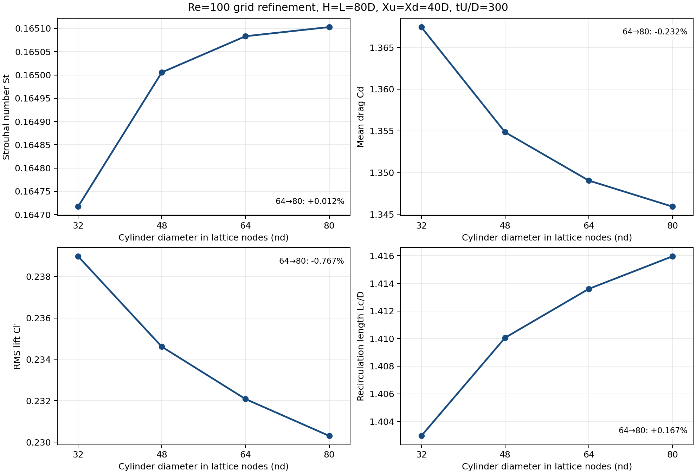
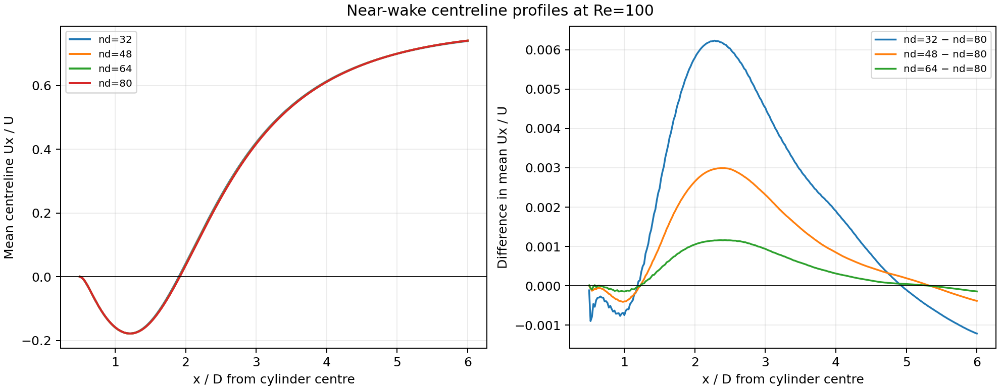

# Re=100 网格收敛核验

## 对照条件

固定 Re=100、H=L=80D、圆柱中心距入口/出口各 40D、U=0.06、D2Q9 MRT、PSM 圆柱边界、横向/出口吸收层各 8D/6D 和相同边界参数，仅改变圆柱直径对应的格点数 nd=32、48、64、80。四例均运行到 tU/D=300。升阻力取末 10 个完整涡脱落周期，回流长度来自末期约 3 个周期的平均速度场，从圆柱尾缘起算。

作为统计时长核对，nd=32 的本次 tU/D=300 与先前 tU/D=400 的四个指标最大差异为 0.0125%，低于网格间差异。

nd=48 使用先前在同一求解器版本、同一设置下完成的结果，其余三个网格为本次重算。全部四例均重新核验了力历史与汇总统计的一致性。

## 数值结果

| nd | h/D | 网格点数 | St | Cd | Cl′ RMS | Lc/D | 升力振幅漂移 |
|---:|---:|---:|---:|---:|---:|---:|---:|
| 32 | 0.03125 | 2560×2560 | 0.164717 | 1.367441 | 0.238978 | 1.40295 | +0.0169% |
| 48 | 0.02083 | 3840×3840 | 0.165006 | 1.354844 | 0.234610 | 1.41006 | +0.0148% |
| 64 | 0.01562 | 5120×5120 | 0.165083 | 1.349046 | 0.232081 | 1.41360 | +0.0137% |
| 80 | 0.01250 | 6400×6400 | 0.165103 | 1.345922 | 0.230300 | 1.41596 | -0.0020% |

相邻网格的相对变化以下一个、更细网格的结果为分母；符号表示加密后的变化方向。

| 网格变化 | ΔSt | ΔCd | ΔCl′ RMS | ΔLc/D |
|---|---:|---:|---:|---:|
| 32→48 | +0.175% | -0.930% | -1.862% | +0.504% |
| 48→64 | +0.047% | -0.430% | -1.090% | +0.250% |
| 64→80 | +0.012% | -0.232% | -0.773% | +0.167% |

## 判定与误差范围

按相邻网格的工程判据——最细相邻网格的 St、Cd、Cl′ RMS 和 Lc/D 全部变化小于 1%，且末期升力振幅漂移小于 0.1%——nd=64→80 已达到实用上的网格一致性。
四项中最大的最细相邻变化为 0.773%。该 1% 判据衡量相邻网格一致性，不能单独作为连续方程解误差的严格上界。

对 32/48/64 和 48/64/80 两组三网格分别拟合 `q(h)=q∞+a h^p`，仅在单调且存在正阶数时给出形式上的观测阶 p；最细网格 GCI 用后一组三网格计算，安全系数 1.25：

| 量 | p（32/48/64） | p（48/64/80） | nd=80 的形式 GCI |
|---|---:|---:|---:|
| Strouhal number St | 2.724 | 4.279 | 0.009% |
| Mean drag Cd | 1.234 | 1.415 | 0.782% |
| RMS lift Cl′ | 0.583 | 0.378 | 10.983% |
| Recirculation length Lc/D | 1.011 | 0.592 | 1.474% |

**严格的 1% 网格无关性尚未得到证明。**升力与回流长度的形式 GCI 超过 1%；升力的观测阶还从 0.583 降至 0.378，说明三网格外推并未稳定进入可放心使用的渐近区。11.0% 的升力 GCI 是对该拟合不可靠性的警示，不应当成已测得的真实误差。

GCI 假定三个网格已进入渐近收敛区；若阶数很低、曲线非单调或 GCI 大于相邻变化，应据此保留不确定性，不能把相邻网格变化直接称为离散误差。
圆柱 PSM 过渡层在各网格约为 1 个格点，细化时其物理厚度随 h 缩小；求解器还以半格点偏移打破中心线对称性。二者都可能令观测阶偏离理想空间差分阶数。



## 平均尾迹剖面

在圆柱中心下游 x/D=0.5–6.0 取 276 个共同物理坐标，插值比较末期平均中心线速度 `Ux/U`。与 nd=80 剖面的绝对差异（以 U 归一）为：

| nd | RMS 差异 / U | 最大绝对差异 / U |
|---:|---:|---:|
| 32 | 0.003172 | 0.006232 |
| 48 | 0.001519 | 0.002992 |
| 64 | 0.000600 | 0.001162 |



## 复现

```bash
python domain_sweep.py H80_L80_Xu40_nd32_t300 H80_L80_Xu40_nd48 H80_L80_Xu40_nd64 H80_L80_Xu40_nd80 --out results/grid
```

逐例汇总见 [CSV](../data/grid_convergence.csv) 和 [原始 summary JSON](../data/grid_summaries/)；完整 `forces.npz`、`mean.npz` 体积较大，需运行上述命令自行生成。

本核验只改变网格，固定 H=80D 的物理域；有限域误差和边界模型误差仍由[长域验证](re100_validation.md)单独衡量。即使网格趋势稳定，也不能推断绝对 Cd、Cl′ 已与文献完全一致。
